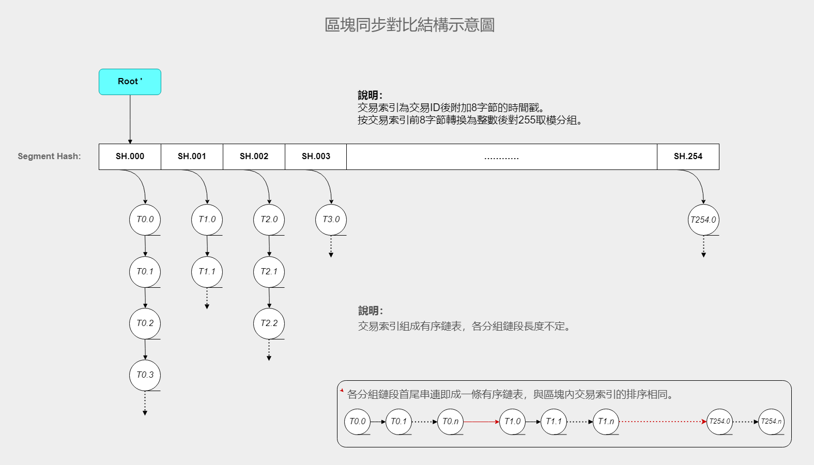

//////////////////////////////////////////////////////////////////////////////
Copyright (c) 2019 @cxio/blockchain

    Permission is granted to copy, distribute and/or modify this document
    under the terms of the GNU Free Documentation License, Version 1.3
    or any later version published by the Free Software Foundation;
    with no Invariant Sections, no Front-Cover Texts, and no Back-Cover Texts.
    A copy of the license is included in the section entitled "GNU
    Free Documentation License".
&&&&&&&&&&&&&&&&&&&&&&&&&&&&&&&&&&&&&&&&&&&&&&&&&&&&&&&&&&&&&&&&&&&&&&&&&&&&&&


## 端點約定

在P2P的世界裏，不同於傳統的「服務器/客戶端」的主從邏輯，相互連接的端點是一個平等的關繫：一個端點從對方獲取服務的同時，也為對方提供服務。端點旣是客戶端也是服務器，兩個端點依靠預先定義的規則平等交互，相互協作，共同形成了自由的P2P網絡。這是一個由契約維繫的去中心化世界，在這裏，所有的端點都遵循共同的規則或約定，這些規則和約定，可以稱之為 **端點約定**。

端點約定並沒有強製力，P2P是自由的，端點也有不遵守約定的自由，但這樣的約定會在現實中形成一道屏障：你可以不遵守約定、破壞規則，但別人會離你而去，當大傢都不理你了，你就脫離了這個世界，變得無足輕重。由此可見，端點約定實際上是P2P世界裏強有力的約束，卽便它沒有名義上的強製力。

端點約定有兩種：一種是可以在最終數據上檢驗合法性的規則，可以稱之為協議。一種是寬鬆的公共守則，如果都遵守，繫統會運作得很好，但不遵守也不會致命，比如大傢在相同的時間做某件事。這種公共守則可以簡單地稱之為公約或約定。

**註**：在網絡語境中，端點有時也稱為節點，在下面的敘述中並不刻意區分兩者。


## 分叉競爭與主鏈保持

前述的擇優池同步並不能絕對保證區塊鏈網絡不產生分區。擇優池中的高權重鑄造者如果沒能及時出塊，或者網絡的原因導致了優質區塊的隔離，分區就可能偶爾出現，這會導致主鏈的分叉。或者，如果有攻擊者分叉出一條支鏈，試圖混淆主鏈或與之競爭，也應當有辦法保證主鏈的清晰和唯一。

這從兩個方面來實現防護：**1.鏈段的競爭力；2.客戶端的主鏈綁定**。


### 鏈段的競爭因子

在Bitcoin的PoW工作量競爭機製裏，累加的難度也是保護歷史區塊的因素，如果攻擊者算力不夠，就無法構造出更長的支鏈來替換主鏈。這種機製簡單有效，到目前為止運行良好。

本設計采用固定地區塊創建時間，不存在最長鏈的邏輯，如果有攻擊者從某個高度分叉出一條支鏈，雙花原主鏈上的交易並參與主鏈競爭，那該如何確定正確的主鏈呢？這就是下面對區塊及其鏈段的競爭力的設計。

鏈段的競爭力來源於區塊的競爭力，區塊的競爭力來源於競爭因子，它們被設計在區塊頭內。

區塊頭結構（共 `80+32` 字節）：

```go
BlockHeader: {
    Version   uint32    // 協議版本
    PrevBlock [32]byte  // 前一區塊哈希
    YearBlock [32]byte  // 前一年塊哈希（height % 87661 == 0 有效）
    Height    uint32    // 區塊高度
    CheckRoot [32]byte  // 校驗根（類似Bitcoin裏的MerkleRoot）
    // 競爭因子
    Phases    uint32    // 擇優權重（擇優池前2位+鑄造者 相位差和合計/3）
    Stakes    uint32    // 幣權銷毀（單位：幣天）
}
```

擇優權重是擇優憑證中 `前2位 + 鑄造者` 的合計平均值，如果鑄造者就是前2名之一，會雙倍之。這樣可以把實際鑄造者的增益（第1名鑄造）或損益（由靠後者鑄造）也考慮進來。卽：區塊的實際鑄造者在擇優池中越靠前越好。

> **附註：**<br>
> 年塊指從創始區塊開始，每年引用一次形成年塊鏈。主要用於附生側鏈對主鏈的高效引用。<br>
> 幣權銷毀更有眞實性，但僅統計歷史標記有效的交易，這使得攻擊者無法通過打包對方鏈上的交易來獲得優勢。<br>
> 區塊頭80字節（有年塊時+32字節）用於計算區塊哈希。區塊頭年數據量：80x87661 ~= 6.688MB。<br>
> 存儲競爭因子的數據類型僅有4字節，通常情況下不會溢出。但如果會溢出，則存儲為最大值本身（0xffffffff）。<br>


### 縱向評估的競爭力

通常來說，因為有擇優池的預選和同步，新區塊又有足夠的傳播時間，主鏈的分叉很難出現。但如果眞的出現了（或者攻擊發生了），以下規則和算法會應用到兩條或多條競爭的分叉上，評選出確定的主鏈：

1. 參與競爭評估的鏈段長度必須到達 `240個` 區塊（1天）。卽支鏈必須成長到足夠的高度才能競爭主鏈，這使得攻擊者必須維持支鏈足夠長的時間，且持續獲得強大的高權重基本盤支持才行，這需要付出極大的代價。
2. 競爭因子的取值是鏈段長度內全部區塊該因子的合計值，卽縱向合計，因此稱為縱向評估。之後再按不同因子進行分級評估。競爭流程如下。

**競爭流程：**

1. **擇優權重**：合計各支鏈段區塊的擇優權重值，計算鏈間平均值。如果兩條支鏈該值的差低於平均值的 `1%` 則視為相等，否則值小者勝。
2. **幣權銷毀**：合計各支鏈段區塊的幣權銷毀值，值大者勝。
3. **最終唯一性**：如果上面的對比依然無法確定勝負，則簡單取分叉後首個區塊的哈希值本身對比，值小者勝。


### 發現分叉

不同於Bitcoin裏節點力圖發現最長鏈，本設計中鏈段的增長完全固定，所有的分叉長度都一樣。如果節點不去請求和檢査區塊頭鏈，就需要一個高效的發現分叉的機製，從而避免節點長時間處於一條弱的分叉上。

發現分叉可以通過接收到的交易數據體現出來，卽交易頭裏的歷史標記會無效。此時客戶端可作如下評估（建議）。

1. 如果發現有較多的合法交易僅僅是歷史標記錯誤，就可以判定存在分叉了。請求分支區塊頭鏈，獲取分叉鏈段信息。
2. 保持自身主鏈不變，持續收集信息至少 `100個` 區塊，然後評估分叉支鏈的競爭力。
3. 如果分叉鏈段競爭力極強，可以考慮立卽切換。否則保持本鏈不變繼續收集到 `200個` 區塊左右，如果分叉明顯優勢，可以切換主鏈。
4. 如果兩條分叉競爭力不相上下，則應等待 `240個` 固定區塊數到達，以最終競爭力計算實現主鏈切換。

> **註記：**<br>
> 正常情況下，歷史標記錯誤的交易不會被收錄進區塊，除非是在分叉合並階段（見下）。<br>
> 在240個區塊長度之前切換主鏈後，節點參與的鑄造競爭也會跟着變換，這實際上可以強化目標分支，增強其競爭力。<br>


### 分叉合並

分叉支鏈上的交易可以提取出來被主鏈合並，是一件很重要的事，它可以避免當分叉出現後用戶的畏懼心理：你不知道該把交易綁定到哪一條鏈。分叉合並可以解決這一難題。

合並隻在主鏈競爭已經明確後才進行，通常是 **按順序逐塊提取** 支鏈上的交易（不再理會歷史標記）。因為鑄幣交易隻能認可一方，源於分叉支鏈上的新幣的交易是無效的，當然支鏈上的雙花交易也會被排除。

如果主鏈出現了分叉，合並機製可以讓用戶繼續交易，隻是會有一些限製。


### 客戶端綁定主鏈的外部約束

在區塊鏈繫統中，客戶端App通常需要硬編碼創始區塊的信息，提供主鏈起始的正確性，使得其它鏈無法冒充正常的主鏈。這種做法簡單直接而且絕對有效。擴展這種思路，如果我們在客戶端App上也硬編碼綁定中間區塊的信息，是否可以從根本上鎖定主鏈呢？這種鎖定在客戶端昇級發布時進行，不斷的發布更新，不斷地鎖定前進中的區塊，從而維持一種根本性的主鏈保護？

這是一種缺乏技朮含量的粗暴做法，但如果可行，則是對區塊鏈及其歷史的一種簡單而又根本性的保護：不需要復雜的機製設計，也沒有性能上的負擔。這裏試作如下分析：

> 區塊鏈是基於一個去中心化的P2P網絡，不同的客戶端遵循同樣的協議相互連接協作，一個客戶端沒有理由去綁定一個錯誤的創始區塊，那太荒謬了。在分叉之前，主鏈是唯一的，如果客戶端綁定某個中間段區塊，不會有任何異樣，人們對這樣的行為是無感的，除非主鏈開始分叉。
>
> 邏輯上，在主鏈分叉以前，客戶端一直跟隨當前的主鏈，如果突然出現一條起始於綁定結點之前的競爭支鏈，客戶端是完全可以忽略的（因為目標已經鎖定）。如果這個結點位置恰當，就可以成為一種通用的約定，從而獲得主鏈的穩定。

客戶端是開源的，它們硬編碼的目標區塊可以査看到。一個客戶端發布出來，在信息上它就處於了公共領域。錯誤的綁定會被發現，也會被抵製，它們不得不接受公眾的監督。

不同的客戶端由不同的開發者或語言實現，它們可能並不嚴格實施這項規範，但官方的客戶端應該保證這樣做（且開源）。新版本的綁定基於運行中的舊版本的當前數據，綁定的結點在分叉之前，所以不存在歧義或分叉裁決的權力問題。


#### 綁定規則

1. 運行期動態綁定。運行着的客戶端會記下2天前第 `-480號` 區塊的哈希，每新出一個區塊更新一次。
2. 發布時硬編碼綁定。從運行着的客戶端獲取當前綁定，嵌入在發布的新版本裏（無需嚴格的時效性）。
3. 在綫成長或突然出現的長度小於 `240塊` 的支鏈會被納入主鏈競爭評估，更長的支鏈因為超出限製會被忽略。

由於客戶端的這種普遍性約定行為，**超過2天（480塊）的歷史區塊將獲得幾乎絕對的保證**。

這不是一種純技朮，它是一種社會化現實效果在技朮結構中的應用。從另一個角度看，它其實是開發者對現實世界裏主鏈共識的一種固化，它們被簡單地書寫在客戶端裏而不是借助於某種算法，是一種社會化行為但依然也是一種共識確認。


### 設計參數

> 區塊頭長度為 `80字節`（不計年塊），包含兩個鏈段競爭因子：擇優權重和幣權銷毀。<br>
> 競爭主鏈的分支必須成長到 `240個` 區塊才有效，沒有成長到該長度的斷鏈會被忽略，因此上面的交易實際上無法迴收。<br>
> 鏈段評估中擇優權重的容差為 `1%`，容度內視為相等。這隻是設計者一個直覺的值，沒有經過論證。<br>
> 客戶端對主鏈的動態綁定為末端 `-480號` 區塊，發布時的靜態編碼從運行着的客戶端中獲取。<br>
> 客戶端對主鏈綁定的外部約束是一種社會性共識而不是數學算法，這不好看但可能是一個重要特點。<br>


## 交易的傳輸

區塊是交易的集合，交易的傳輸影響着鑄造者們對交易的期望以及區塊的內容。一位貪婪的鑄造者可能試圖等待儘量多的交易而影響出塊時間，而交易時間戳的任意性也會讓時間戳缺乏意義。為了某種有序化，需要設計如下規則。


### 適時轉播

交易的時間戳與節點本地的時間相比較，如果它屬於未來，這筆交易就稱為 **未來交易**，區塊不收錄未來的交易（相對於出塊時間點），這是一個基本設計。但定義交易時間戳在未來是允許的，它們隻是暫時處於鏈外，類似於Bitcoin中交易的鏈外鎖定。

這些交易會被正常的校驗和轉播，但有一個例外：**當前區塊時段內的** 未來交易不立卽轉播，節點應等待時間到達後才轉播出去，這就是「適時轉播」。

這一約定主要用於配合零確認的安全機製，確保雙花交易隻在恰當的時間可見（詳見後）。

> **註：**<br>
> 未來交易可能無法綁定相應的-11號區塊，歷史標記位應當置零。這不影響收錄，但會失去鑄造資格。


### 錯時延遲

當一筆交易傳播至節點時，交易的時間戳可能晚於（小於）當前節點的實際時間，如果這一差距較大，就稱這是一筆**錯時交易**。區塊可以收錄錯時的交易（它們屬於過去），但這些錯時交易可能成為鑄造者貪婪的誘餌，影響他們按時出塊，所以這裏設計了一個約定：

**當出塊時間到達後，節點停止時間戳在出塊時間之前的錯時交易的轉播，直到該區塊被創建、廣播並確定下來，之後再恢復這些交易的傳輸**。這就是「錯時延遲」。這不會影響時間戳在下一區塊時段內的交易的正常傳輸。


### 設計要點

> 當前區塊時段內的未來交易應當等到時間到達後才轉播。這是零確認安全的前置措施。<br>
> 時間戳在活躍區塊時間戳之前的錯時交易會暫停傳播，直到活躍區塊眞正確定下來。這可以避免鑄造者的貪婪等待。<br>


## 區塊的結構和同步

邏輯上，區塊隻是一個抽象容器，包含交易的索引用於檢索交易數據本身。交易索引由 `32字節` 的交易ID和 `8字節` 的交易時間戳構成（`32+8`），它們在區塊裏有序排列，讓區塊的構造擁有一種確定性。

### 排序規則

1. **一級排序**：交易索引的前8字節轉換為整數（大端序），然後對255取模運算值排序。
2. **二級排序**：如果一級排序相等（同組），則簡單地按交易索引本身的字節序列排序。

**說明：**
> 用交易索引前8字節取整數是為了獲得一種隨機性，避免可能的ID塑造搗亂。<br>
> 對255取模分組是為了快速定位和壓縮排序的子集。註：不是對256取模（留出一個值有用）。<br>
> 這一排序規則與UTXO指紋（後續說明）的分級排序規則相兼容。<br>


### 四元鏈哈希樹

區塊需要驗證，在Bitcoin中是通過對交易ID集的默克爾樹來實現。本設計中采用功能類似的四元鏈哈希校驗樹結構，如下圖。


**說明：**
- 平行的鏈式結構方便逐層或跨層地提取哈希值，實現快速的交互對比。
- 最末端的交易索引葉子節點依然可以簡單定位，整個序列有序排列。
- 該哈希樹僅在最終出塊時構建，並不用於內存結構中動態插入交易信息。


### 區塊的同步

區塊可能包含大量的交易，假設有64k筆，則區塊所涉及的數據可能達數十上百兆。這使得在一個較短的區塊時段內傳輸全部數據很困難，至少是不可靠。

但實際上事情並沒有那麽糟糕，因為如果節點一直在綫，區塊所涉及的交易大多已經被節點收集和驗證了（數據已經存在）。區塊之所以需要同步，是因為鑄造者打包了它，而鑄造者收集的交易集可能稍有不同。所以，區塊同步實際上隻需要釐清並補足那些少量差異的部分，然後節點自行構造區塊卽可。

如下分組結構被用於當前區塊交易的動態插入和同步時的差異對比。

#### 255段分組

1. 一級分組：255個單元（卽上面的一級排序），每單元為一組。
2. 二級成員：上面每一組中包含各自的交易索引，按交易索引的字節序列排序（上面的二級排序）。

**對比結構圖**



> **註：**
> 基本上，這可以看作是一個寬成員的三級哈希校驗樹。

區塊同步前，鑄造者計算每一組的交易子集的哈希根，然後合並255個單元的哈希根計算根哈希（`Root'`）。當同步對比時，如果接收到的根哈希不同，則說明交易集有差異，於是就可以對255組的哈希根並行地進行對比，査找差異並請求缺少的交易。

為了全網儘快統一共識，區塊的廣播隻需要包含必要的區塊證明：

- Coinbase交易；
- 分組校對的哈希樹根（`Root'`）；
- 四元鏈哈希樹根（`CheckRoot`）；
- 相關的簽名數據。


### 設計要點

> 區塊同步隻需要對比發現不同的部分然後補足卽可，交易ID在區塊內的有序排列是一種確定性約束。<br>
> 區塊的發布隻需要包含必要的可驗證數據，實現快速廣播。之後再同步交易數據。<br>
> 四元鏈哈希樹被用於構造區塊驗證（區塊頭內的校驗根）和歷史區塊對比下載的用途，類似於默克爾樹。<br>


## 零確認的安全性

交易在網絡上的傳輸沒有先後順序，原則上，交易一旦廣播出去便無法撤迴。如果存在雙花的交易，鑄造者會優先打包時間戳更早的交易（暫不考慮交易費問題），這是一個簡單的約定，也是零確認安全機製的前提。

攻擊者可以構造兩筆相同輸入源的雙花交易，其中一筆時間戳更早（可能交易費也更高）但晚一點發送。如果接收者認可零確認，在收到前一筆交易後發貨或讓顧客拿貨離開，但最終進入區塊的卻是後一筆交易。這會讓零確認的安全無法實行。

不過，借助於更精細的一些規則設計，我們可以很大程度上避免這種攻擊行為。

> **註：**<br>
> 零確認安全有一個時間上的閾值，這裏的設計是1分鈡。卽：收款方需要等待至少1分鈡才能確認安全。


### 時序保障

雙花交易可能來自於用戶的糾錯行為：發送一筆交易後發現失誤，立卽重構一筆新交易發出。這是允許的，但有一些約束。

1. 更正交易需要設置為更早的時間戳。考慮可靠性，交易費不應當低於前一筆失誤交易。
2. 更正交易需要在失誤交易發送後1分鈡之內發出。這是一個規定閾值，否則更正交易會被丟棄。

對於一個中轉節點來說，接收到交易驗證合法後會存儲到內存池中，同時也需要記錄交易的實際收到時間（註：可以是與交易時間戳的差值）。如果發現新收到的交易是一筆雙花交易，它們根據下面的規則行事。

1. 如果新交易的時間戳更晚（值更大），則忽略丟棄。因為區塊應當收錄更早的交易。
2. 如果新交易的時間戳更早（值更小），則檢査時間戳與當前實際時間的誤差：1分鈡內視為更正交易正常轉播，否則視為雙花攻擊丟棄。
3. 如果新交易的時間戳與原交易相同，則檢査原交易的實際收錄時間，如果在1分鈡之內，也視為正常的更正交易轉播，否則視為雙花攻擊丟棄。

> **註：**<br>
> 閾值之內的雙花交易可以被鑄造者觀察到，收錄較早交易隻是一個鬆約束（可自由裁定）。


#### 攻擊分析

**攻擊：**

- 方式：前一筆交易提前發送，但時間戳設置得比較晚（值大），後一筆交易晚發送，但時間戳設置得比較早（值小）。
- 目的：希望前一筆交易被商傢認可，但區塊實際收錄後一筆交易。
- 約束：兩筆雙花交易的實際發送時間差需要大於 `1分鈡`，因為商傢會要求等待1分鈡以上（安全閾值）。

**分析：**

1. 前一筆交易的時間戳如果晚於實際時間，會被「適時轉播」規則阻塞，因此商傢並不會提前看到這一筆交易。
2. 前一筆交易的時間戳如果早於當前實際時間，轉播不受影響，但第二筆交易的時間戳必須更早，如果時差超過閾值，則會被「時序保障」規則濾掉。
3. 如果兩筆交易的時間戳相等，交易的傳播受實際收錄時間相差1分鈡的閾值保護，這也不會有問題。

**結論：**

1. 雙花的第二筆交易廣播時間超出閾值後，實際上很難廣播出去，所以鑄造者很難收到第二筆交易。
2. 收款者收到一筆支付後，稍微等待一段時間（1分鈡+），就可以看到是否存在雙花的情況，然後自行處理。


### 最低交易費

交易費是礦工的重要收入來源，提供服務收取費用是一種正常的邏輯。區塊收錄交易的數量是有限的，因此交易費的高低源於市場的驅動，但一個恰當的最低交易費規則是有益的。

本設計的鑄造資格源於歷史交易，最低交易費的門檻可以與幣權一起，提高僅僅為鑄造資格構造大量細微交易的成本。另外，如果沒有此規則，太低的交易費可能導致鑄造者長期不收錄它們，棄置太久的交易會最終失效（2天），這瓦解了零確認的安全性。

最低交易費由前期的平均交易費自動計算而來：**繫統每 `24000個` 區塊（100天）統計一次，取平均值的 `1/5` 作為當前階段的最低交易費**。這是一個端點間公約而不是交易協議，各個端點檢査交易費情況，低於最低值的交易將被丟棄。

**註意**：零確認安全隻是一種簡單設計，應當隻用在小額收款上。如果你有大額交易，等待眞正的區塊確認會更好。


#### 附：交易過期

未被收錄的交易超過一定時間後會作廢，這個期限設計為2天（`480個` 區塊）。過期是按交易的時間戳和當前時間對比判斷的，它的意義在於：

1. 縮減未確認交易的規模。
2. 提昇時間因子的價值，為某些應用提供條件。
3. 設置一個明確的時間點，讓鑄憑交易的範圍合法性判斷可以很簡單。

人們不應當期待一筆超過2天都未完成（確認）的交易依然有效，漫長的期待實際上也有一種負面的心理效應。


### 設計要點

> 鑄造者優先打包時間戳更早的交易，這是處理雙花交易的基本規則，但它是一個寬鬆約束。<br>
> 交易更正有一個 `1分鈡` 的時間容度（閾值），超過之後的交易將被視為雙花攻擊而被阻塞。<br>
> 收款方如果認可零確認交易，應當等待至少 `1分鈡` 以發現是否存在雙花攻擊。<br>
> 最低交易費采用前期 `24000個` 區塊平均交易費的 `1/5` 作為當前階段的值，但這隻是一個端點公約。<br>
> 長時間遊離於鏈外的交易會過期，按時間戳計算超過2天 `480個` 區塊時段卽為失效。<br>


-------------------------------------------------------------------------------

上一篇：[共識模型-概率證明（PoP）](1.共識模型-概率證明（PoP）.md)<br>
下一篇：[公共服務](3.公共服務.md)<br>
