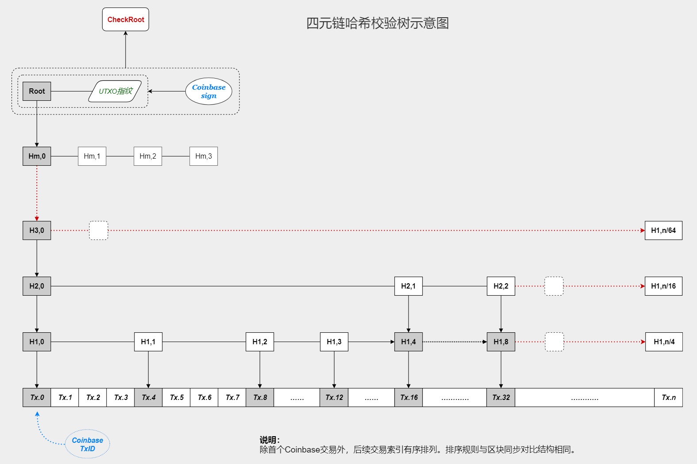

//////////////////////////////////////////////////////////////////////////////
Copyright (c) 2019 - 2024 @cxio/blockchain

    Permission is granted to copy, distribute and/or modify this document
    under the terms of the GNU Free Documentation License, Version 1.3
    or any later version published by the Free Software Foundation;
    with no Invariant Sections, no Front-Cover Texts, and no Back-Cover Texts.
    A copy of the license is included in the section entitled "GNU
    Free Documentation License".
&&&&&&&&&&&&&&&&&&&&&&&&&&&&&&&&&&&&&&&&&&&&&&&&&&&&&&&&&&&&&&&&&&&&&&&&&&&&&&


## 端点约定

在P2P的网络里，不同于传统「客户端/服务器」的主从逻辑，相互连接的节点是一个平等的关系：一个节点从对方获取服务的同时，也为对方提供服务。一个节点既是客户端也是服务器，两端依靠预先定义的规则交互与协作。这是一个由契约维系的去中心化世界，在这里，所有的节点都遵循共同的规则或约定，这些规则和约定，这里统称为 **端点约定**。

端点约定有两种：一种是可以在最终数据上检验合法性的规则，称之为协议。一种是宽松的公共守则，如果都遵守，系统会运作得更好，但不遵守也不会有太大的问题，比如大家在相同的时间做同一件事。这种公共守则我们简单地称之为约定。

约定并没有强制力，因为P2P是自由的。但为什么不遵守呢？如果不遵守并不能带来利益，就应该不会导致问题。毕竟，P2P的本质就是需要协作、共同努力。

**注**：节点有时也称为端点，在后面的行文中并不刻意区分。


## 分叉竞争

虽然通过择优池可以获得很好的确定性，但这并不能保证区块链绝不出现分叉。如果择优池中的高权重者没有按时出块，或者网络原因导致了优质区块的隔离，又或者有私自挖矿的攻击，分叉就可能出现。


### 链段的竞争因子

在Bitcoin的PoW工作量竞争机制里，区块高度是主链的判断依据，因为累加的难度就是保护历史区块的因子，如果攻击者算力不够，就无法构造出更长的支链来替换主链。

本设计采用固定的区块创建时间间隔，没有最长链逻辑，因此需要设计某种判断依据。这里采用区块链末端固定长度的链段竞争力来实现。

链段的竞争力来源于区块的竞争力，区块的竞争力依托于竞争因子**择优权重**，它被设计在区块头内。

区块头结构（共 `80+32` 字节）：

```go
BlockHeader: {
    Version   uint32    // 协议版本
    PrevBlock [32]byte  // 前一区块哈希
    YearBlock [32]byte  // 前一年块哈希（height % 87661 == 0 有效）
    Height    uint32    // 区块高度
    CheckRoot [32]byte  // 校验根（类似Bitcoin里的MerkleRoot）
    Phases    uint32    // 择优权重（择优池前2位+铸造者/3）
    Stakes    uint32    // 币权销毁（单位：币天）
}
```

择优权重是择优凭证中 `前2位 + 铸造者` 的合计平均值，如果铸造者就是前2名之一，则会双倍之。

> **附注：**<br>
> 年块指从创始区块开始，每年引用一次形成年块链。主要用于附生侧链对主链的高效引用。<br>
> 币权销毁更有真实性，主要方便于某些需要统计的场合。<br>
> 区块头80字节（有年块时+32字节）用于计算区块哈希。区块头年数据量：80x87661 ~= 6.688MB。<br>
> 择优权重和币权销毁的数据类型仅有4字节，通常不会溢出。但如果溢出了，则存储为最大值（0xffffffff）。<br>


### 纵向评估的竞争力

通常来说，因为有择优池的预选和同步，新区块又有足够的传播时间，主链的分叉很难出现。但如果真的出现了（或者攻击发生了），以下规则和算法会应用到两条或多条竞争的分叉上，评选出确定的主链：

1. 参与竞争评估的链段长度必须到达 `30个` 区块（3小时）。即支链必须成长到足够的高度才能竞争主链。这使得攻击者必须维持支链足够长的时间，且持续获得强大的高权重基本盘支持才行，这需要付出不小的代价。
2. 竞争评估是链段长度内全部30个区块择优权重的合计值，如果某分叉的长度已经超出30个区块，则不再进行评估。也即该分叉将被视为一条正常的分叉而不予理会。
3. 区块链的增长是实时的，不同的分叉会被即时发现，如果刚出现的一条分叉就有了一定长度，则很可能是私有挖矿攻击。如果其长度超出了规定则无需理会（攻击就失去了意义），而如果符合规定，则进入正常的竞争流程。

**竞争规则：**

1. **择优权重**：分别计算各支链分叉后30个区块的择优权重合计值，值小者胜出。
2. **最终唯一性**：如果择优权重无法确定胜负，我们简单地取分叉后首个区块的哈希值本身对比，值小者胜出。

> **注记：**
> 设计一定分叉长度不只是增加攻击的难度，如果网络因为某种物理原因而分区了，3个小时的缓冲期可能足以让分区重新合一。


### 安全性

因为分叉之后的纵向评估仅针对末端的30个区块，超出30个区块的分叉被视为一个合法的支链，所以实际上这会带来一种“绝对”的安全性，即：一笔交易如果已经被30个以上数量区块确认，那它就是绝对安全的。没有攻击者能够创建一个更长的分支来双花它的交易输入（收款项）。


#### 主链混淆攻击

可能会有另一种攻击出现：强大的攻击者悄悄创造一条分叉，等待30个区块的末端竞争已经过去，自己变成一条正常的支链，然后发布并宣称自己才是正统的主链（即便竞争计算也不会胜出）。

这是一种非技术的社会化攻击，但依然可能出现。


#### 客户端绑定确认

官方发布的App会硬编码绑定当时的主链（末端-31号区块ID），这样可以辅助确认主链，但官方App的发布周期会比3个小时长得多，因此只能阻止超长分支对主链的混淆。

> **注：**
> App中有主链核实逻辑，如果绑定错误会被即时发现（无法入网）。


#### 当前状态的证明

对于上面这种公然的社会化攻击，实际上很难有技术措施来保证，除了诉诸法律。

但如果网络能记住一条区块链实时的状况，就可以让事情变得简单很多。一个参考性的想法：*如果有另一条区块链正常运行，而当前区块链的基本信息会在那条链上及时登记，来获得一种存在性证明*，则法律诉讼会容易得多，或者压根不需要诉讼。新用户会很容易判断哪一条分叉才是真正的主链。

存在性证明是区块链的天然能力，因此**多链协作**或许是一个更简单的现实解决方案。这有点像CA的逻辑，只不过是去中心化的，也是免官方权威的。


### 发现分叉

节点间的交互信息中包含有当前末端区块的ID，因此很容易就知道当前是否出现了分叉。

如果出现了分叉，节点客户端可以采用如下几种策略：

- 实时计算分叉链段的竞争力，即时切换主链。
- 保持自身主链不变，持续收集信息至某个长度，评估该链段的竞争力，决定是否切换。
- 保持自身主链不变，等待至最终长度（`20个`）后再计算链段竞争力，然后切换。

注意，这里发现的分叉指的是一个完全不同的支链，即并不是由于择优池中第一名延迟发布区块导致。这通常仅在全球网络致命瘫痪，导致整体网络分区才会带来这样的问题。

在区块链节点运行的实际环境中，如果择优池冠军未能及时出块，各节点采用亚军（甚至季军）的区块，而后来该冠军又补充出块，于是导致分叉。此时该冠军区块的分叉会被保留待观察。因为签发区块的铸造者都是本链成长过程中择优池的合法成员，所以这样的分叉被命名为**本系**（或系内）分叉。与本系分叉相比，上面所说的**完全不同的支链**，可以被命名为**外部**（或系外）分叉。

外部分叉需要等待到限定的长度（`20个`）才能最终决断，但系内分叉可以实时终结，规则可以更简单一些。

> **系内竞争：**
> 分叉之后，只要有一个区块由择优池冠军签发，且其链段的权重合计不低于另一个分叉，则结束竞争。
> 铸造者在签发区块前应当先评估分叉的竞争力，然后理性地选择。这应该不是一个问题。

总之，不论系内系外，分叉支链在成长到限定的长度后，都会被最终评估，决出胜负，结束分叉。


### 分叉合并

分叉出现后，在决出主链的30个区块时段内，会带来一个问题：用户不知道哪条链上的交易是最终有效的。这是一件不能被简单忽略的事，因此分叉需要被合并。

通常，一笔交易会被不同的分叉同时打包，所以需要合并的交易实际上可能并不多。合并只在主链竞争已经明确后才进行，通常是采用 **按顺序逐块提取** 的优先方式。

> **注：**
> 区块上的新铸币需要经历24个区块之后才能兑现（与服务奖励冻结期一致），所以这里不会有新币输入源无效的问题。


### 设计参数

> 区块头长度为 `80字节`（不计年块），包含链段竞争因子择优权重，以及一个主要用于统计分析的币权销毁字段。
> 竞争主链的分支必须成长到 `20个` 区块才有效，没有成长到该长度的断链会被忽略，因此上面的交易也不会被回收。


## 交易的传输

区块是交易的集合，交易的传输影响着铸造者们对交易的期望以及区块的内容。一位贪婪的铸造者可能试图等待尽量多的交易而影响出块时间，而交易时间戳的任意性也会让时间戳缺乏意义。为了某种有序化，需要设计如下规则。


### 适时转播

交易的时间戳与节点本地的时间相比较，如果它属于未来，这笔交易就称为 **未来交易**，区块不收录未来的交易（相对于出块时间点），但定义交易时间戳在未来是允许的，它们只是暂时处于链外，类似于Bitcoin中交易的链外锁定。

这些交易会被正常的校验和转播，但有一个例外：**当前区块时段内的** 未来交易不立即转播，节点应等待时间到达后才转播出去，这就是「适时转播」。

这一约定主要用于配合零确认的安全机制，确保双花交易只在恰当的时间可见（详见后）。

> **注：**
> 未来交易可能无法绑定相应的-11号区块，历史标记位应当置零。这不影响收录，但会失去铸造资格。


### 错时延迟

当一笔交易传播至节点时，交易的时间戳可能晚于（小于）当前节点的实际时间，如果这一差距较大，就称这是一笔**错时交易**。区块可以收录错时的交易（它们属于过去），但这些错时交易可能成为铸造者贪婪的诱饵，影响他们按时出块，所以这里设计了一个约定：

**当出块时间到达后，时间戳在出块时间之前的错时交易会被暂停转播，直到该区块被创建、广播并确定下来**，之后再恢复这些交易的传输。这就是「错时延迟」。对于区块铸造者来说，时间到了，就没有可打包的新交易传输过来了，所以就没必要等待，按时出块即可。


### 设计要点

> 当前区块时段内的未来交易应当等到时间到达后才转播。这是零确认安全的前置措施。<br>
> 按时间计算，在最新区块时间戳之前的交易（已错时）会被暂停传播，以避免铸造者的贪婪等待。<br>


## 区块的结构和同步

逻辑上，区块只是一个抽象容器，包含交易的索引用于检索交易数据本身。交易索引由 `32字节的交易ID + 4字节的序位` 构成，它们在区块里有序排列，让区块的构造拥有一种确定性。

末尾的4字节序位是实际存在的，可用于辅助验证第三方**区块查询服务**提供的数据：交易的输入源由**区块高度**、区块中交易的**序位**和脚本在输出集内的**偏移位**构成，因此验证第三方是否按序位提供数据，就需要此处的索引中包含序位。

**验证：**
> 第三方服务根据客户提供的**区块高度**、**交易序位**和**输出偏移位**向客户提供*交易数据*和*验证树哈希集*，
> 客户计算交易数据得到**交易ID**，附加交易序位构造**索引**，结合服务方提供的验证树哈希集，就可以计算四元链哈希树的根哈希，从而完成验证。


### 四元链哈希树

本设计中采用默克尔树类似功能的四元链哈希校验树结构，如下。



**说明：**
- 平行的链式结构方便逐层或跨层地提取哈希值，实现快速的交互对比。
- 最末端的交易索引叶子节点依然可以简单定位，整个序列有序排列。
- 该哈希树仅在最终出块时构建，并不用于内存结构中动态插入交易信息。


### 区块的同步

区块可能包含大量的交易，假设有64k笔，则区块所涉及的数据可能达数十上百兆。这使得在一个较短的区块时段内传输全部数据较为困难，或者是不可靠。

但实际上事情并没有那么糟糕，因为如果节点一直在线，区块所涉及的交易大多已经被节点收集和验证了（数据已经存在）。区块之所以需要同步，是因为铸造者打包了它，而铸造者收集的交易集可能稍有不同。所以，区块同步实际上只需要厘清并补足那些少量差异的部分，然后节点自行构造区块即可。


### 设计要点

> 区块同步只需要对比发现不同的部分然后补足即可，交易ID在区块内的有序排列是一种确定性约束。<br>
> 区块的发布只需要包含必要的可验证数据，实现快速广播。之后再同步交易数据。<br>
> 四元链哈希树被用于构造区块验证（区块头内的校验根）和历史区块对比下载、第三方交易数据验证等用途。<br>


## 零确认的安全性

交易在网络上的传输没有先后顺序，原则上，交易一旦广播出去便无法撤回。如果存在双花的交易，铸造者会优先打包时间戳更早的交易（暂不考虑交易费问题），这是一个简单的约定，也是零确认安全机制的前提。

攻击者可以构造两笔相同输入源的双花交易，其中一笔时间戳更早（可能交易费也更高）但晚一点发送。如果接收者认可零确认，在收到前一笔交易后发货或让顾客拿货离开，但最终进入区块的却是后一笔交易。这会让零确认的安全无法实行。

不过，借助于更精细的一些规则设计，我们可以很大程度上避免这种攻击行为。

> **注：**<br>
> 零确认安全有一个时间上的阈值，这里的设计是1分钟。即：收款方需要等待至少1分钟才能确认安全。
> 零确认安全只是一种简单设计，应当只用在小额收款上，大额交易应当等待真正的区块确认。


### 时序保障

双花交易可能来自于用户的纠错行为：发送一笔交易后发现失误，立即重构一笔新交易发出。这是允许的，但有一些约束。

1. 更正交易需要设置为更早的时间戳。考虑可靠性，交易费不应当低于前一笔失误交易。
2. 更正交易需要在失误交易发送后1分钟之内发出。这是一个规定阈值，否则更正交易会被丢弃。

对于一个中转节点来说，接收到交易验证合法后会存储到内存池中，同时也需要记录交易的实际收到时间（注：可以是与交易时间戳的差值）。如果发现新收到的交易是一笔双花交易，它们根据下面的规则行事。

1. 如果新交易的时间戳更晚（值更大），则忽略丢弃。因为区块应当收录更早的交易。
2. 如果新交易的时间戳更早（值更小），则检查时间戳与当前实际时间的误差：1分钟内视为更正交易正常转播，否则视为双花攻击丢弃。
3. 如果新交易的时间戳与原交易相同，则检查原交易的实际收录时间，如果在1分钟之内，也视为正常的更正交易转播，否则视为双花攻击丢弃。

> **注：**<br>
> 阈值之内的双花交易可以被铸造者观察到，收录较早交易只是一个松约束（可自由裁定）。


#### 攻击分析

**攻击：**

- 方式：前一笔交易提前发送，但时间戳设置得比较晚（值大），后一笔交易晚发送，但时间戳设置得比较早（值小）。
- 目的：希望前一笔交易被商家认可，但区块实际收录后一笔交易。
- 约束：两笔双花交易的实际发送时间差需要大于 `1分钟`，因为商家会要求等待1分钟以上（安全阈值）。

**分析：**

1. 前一笔交易的时间戳如果晚于实际时间，会被「适时转播」规则阻塞，因此商家并不会提前看到这一笔交易。
2. 前一笔交易的时间戳如果早于当前实际时间，转播不受影响，但第二笔交易的时间戳必须更早，如果时差超过阈值，则会被「时序保障」规则滤掉。
3. 如果两笔交易的时间戳相等，交易的传播受实际收录时间相差1分钟的阈值保护，这也不会有问题。

**结论：**

1. 双花的第二笔交易广播时间超出阈值后，实际上很难广播出去，所以铸造者很难收到第二笔交易。
2. 收款者收到一笔支付后，稍微等待一段时间（1分钟+），就可以看到是否存在双花的情况，然后自行处理。


### 最低交易费

交易费是矿工的重要收入来源，提供服务收取费用是一种正常的逻辑。区块收录交易的数量是有限的，因此交易费的高低源于市场的驱动，不过一个恰当的最低交易费规则是有益的。

铸币的资格源于历史的交易，最低交易费可提高仅仅为铸造资格而构造大量细微交易的成本。另外，如果没有此规则，太低的交易费可能导致铸造者长期不收录它们，弃置太久的交易会最终失效（2天），这瓦解了零确认的安全性（**解**：接受零确认交易的收款方可提出交易费要求）。

最低交易费由前期的平均交易费计算而来：系统每 `24000个` 区块（100天）统计一次，取平均值的 `1/4` 作为当前阶段的最低交易费。

注意，这只是一个端点间约定而不是交易协议，各个端点检查统计交易费情况，自行决定自己的交易费检查策略。


#### 附：交易过期

未被收录的交易超过一定时间后会作废，这个期限设计为2天（`480个` 区块）。过期是按交易的时间戳和当前时间对比判断的，它的意义在于：

1. 缩减未确认交易的规模。
2. 提升时间因子的价值，为某些应用提供条件。

人们不应当期待一笔超过2天都未完成（确认）的交易依然有效，漫长的期待实际上也有一种负面的心理效应。


### 区块最低交易量

当前可收录交易是一个大的集合，如果区块收录交易的量未达临界值，则必须满足一个最小量：比如总量的70～60%（软～硬限制）。如果已经到达临界值则可忽略。

最小量可能按币权计算，临界值则通常是数量或体积限制。

这可以避免铸造者在择优池中明确后，脱离交易校验工作（组队校验时），自己打包一个交易很少的区块来获得铸币收益。


### 设计要点

> 铸造者优先打包时间戳更早的交易，这是处理双花交易的基本规则，但它是一个宽松约束。
> 交易更正有一个 `1分钟` 的时间容度（阈值），超过之后的交易将被视为双花攻击而被阻塞。
> 收款方如果认可零确认交易，应当等待至少 `1分钟` 以发现是否存在双花攻击。
> 最低交易费采用前期 `24000个` 区块平均交易费的 `1/4` 作为当前阶段的值，但这只是一个约定。
> 长时间游离于链外的交易会过期，按时间戳计算超过2天 `480个` 区块时段即为失效。
> 区块必须包含足够量的交易，至少如总量的60～70%，避免组队校验中铸造者的自私行为。


-------------------------------------------------------------------------------

上一篇：[共识模型-历史证明（PoH）](1.共识模型-历史证明（PoH）.md)<br>
下一篇：[公共服务](3.公共服务.md)<br>
