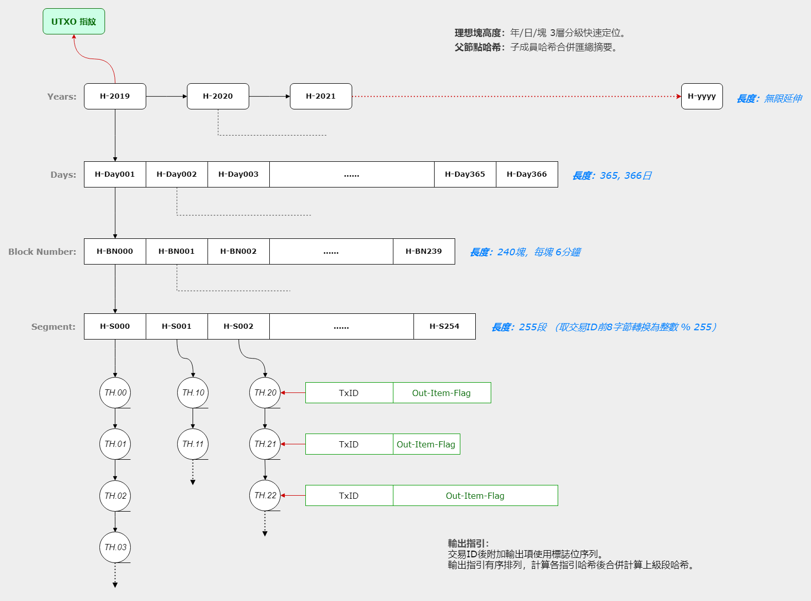

//////////////////////////////////////////////////////////////////////////////
Copyright (c) 2019 @cxio/blockchain

    Permission is granted to copy, distribute and/or modify this document
    under the terms of the GNU Free Documentation License, Version 1.3
    or any later version published by the Free Software Foundation;
    with no Invariant Sections, no Front-Cover Texts, and no Back-Cover Texts.
    A copy of the license is included in the section entitled "GNU
    Free Documentation License".
&&&&&&&&&&&&&&&&&&&&&&&&&&&&&&&&&&&&&&&&&&&&&&&&&&&&&&&&&&&&&&&&&&&&&&&&&&&&&&


在傳統的設計中，一個復雜的繫統往往被分解為擁有內在邏輯的簡單子繫統，這是構造復雜繫統的方法。如果我們把P2P網絡整個看作一個繫統，根據P2P網絡運行所需要的邏輯，實際上可以從區塊鏈繫統中分解出一些通用公共的服務組件。

這些公共服務組件也是開放的P2P網絡，任何人都可以參與，用戶隻需要貢獻CPU、內存或磁盤資源。不同公共服務的資源需求是不同的，有的依賴於磁盤存儲，有的偏向於大內存，而一個節點發現服務僅僅需要一臺樹莓派或安卓手機就可以了。


## 服務的分解

繫統可以分解為 `2個通用的公共服務`、`2個寄居微服務`，它們為基礎層級，是通用和公共的P2P服務網絡。具體的各類區塊鏈繫統相對於公共服務則為應用層，這些應用層相對於終端用戶則也是一種公共的服務。

1. **節點發現（findings）**：作為一個基礎服務，負責應用節點的登記、緩存，提供節點相互連繫的信息。功能簡單，獨立組網。
2. **數據驛站（depots）**：數據傳輸的中轉和停靠，可能實現為一個容器，封裝內部微服務的數據請求，實現數據的全網流通和交互。
3. **檔案存儲（archives）**：一個微服務，存儲區塊中交易攜帶的附件數據。由數據驛站封裝，無需直接的網絡能力。
4. **區塊査詢（blockqs）**：一個微服務，分離區塊數據的存儲負擔，提供公共的區塊査詢。同上由數據驛站封裝，自身無需網絡能力。
5. **區塊鏈應用（xxx...）**：負責自身交易的具體應用。是上面4種公共服務之下的應用層，自身組網成為應用網絡，依托於公共服務網絡。

> **註：**<br>
> 區塊査詢通常僅服務於某一特定的區塊鏈，但檔案存儲和節點發現則可服務於任何區塊鏈應用。<br>


### 服務關繫圖


**說明：**
- Peer為區塊鏈應用節點，相互連接形成自己的P2P網絡，同時也與公共服務節點（F，Da, Db）保持連接。
- 同類公共服務節點之間相互連接形成自己的P2P服務網絡，其中findings節點是其它所有網絡節點的連繫中介。
- 括號內的信息表示連接包含，如：Peer通常應連接3個F節點，4個Da和4個Db節點、10個同類節點。


## 節點發現（findings）

提供各種類型節點的登記註冊，維護一個節點連繫信息的暫存池，向請求目標類型節點信息的用戶提供連繫清單。節點類型包含同類節點（findings）、應用節點（各種區塊鏈）和其它公共服務節點（Da, Db）。另外，作為P2P網絡的基礎性支撐，提供NAT打洞服務的連接協助（多機協作，無需雙IP）。

通常，應用節點會啓動一個findings服務器，該服務器通過多種方式蒐尋其它findings服務節點進行組網。如果存在已知的公共findings節點，組網會很快，否則可能是一個比較耗時的過程，如果需要findings實時可用，運行一個長期在綫的服務器（掛機）可能更簡單。

服務器會向請求節點信息的區塊鏈應用提供同類區塊鏈的地址，用於接收可能有的奬勵。除了公共服務節點外，對不同的區塊鏈應用可能有所選擇，當然公益包容的態度也未嘗不可。服務器通常會先聲明自己支持的區塊鏈標識名，或者是支持任意的區塊鏈。


### 吝嗇的區塊鏈

對公共服務節點的奬勵不是強製的，也沒有簡單的辦法去約束，因此自私的區塊鏈應用可能並不樂意支付報酬。這很糟糕，但可能事實也並非如此嚴重。

在鑄造收益裏劃出一部分作為外部奬勵，並不是一件很困難的事，甚至都可能不是一種損失，因為區塊鏈的價值來源於用戶對它的信任或觀感，一條吝嗇的區塊鏈和一條公允的區塊鏈，它們給用戶帶來的觀感有什麽區別呢？當然，或許世事難料……但可以有信心。


### 關於非區塊鏈應用

公共服務的運行基於區塊鏈代幣激勵的能力，這對於非區塊鏈的普通P2P應用來說沒有意義，它們可能很難獲得這些公共服務的支持（雖然邏輯上公共服務是P2P通用的）。但是，如果有一條專門服務於非區塊鏈應用節點連繫的區塊鏈，事情就有所不同了。

普通的P2P應用購買某區塊鏈代幣，獲得同類節點發現的能力（或者更多），從而實現簡單容易的組網……這是可能的。


### 項目參考

節點發現：[github.com/cxio/findings](https://github.com/cxio/findings)


## 數據驛站（depots）

在傳統的P2P網絡裏，相同應用的節點間相互連接，交互彼此需要或擁有的數據，不同應用之間是隔離的（卽便操作的是同一份數據）。數據驛站服務試圖在不同的應用繫統之間抽象出統一的接口，專門操作數據本身，最大限度地剝離應用的負載，同時也提高效率。

實際上，這樣的數據服務可以成為P2P網絡的通用數據層，如果把網絡比喻為一臺計算機，這一數據層就類似於文件繫統的服務。

數據驛站是一個「殻」，管理數據在全網的流通和緩存，內部由具體的微服務實際操作數據（如：archives、blockqs）。基本上，這可以理解為一個內含數據倉庫或處理器的數據中轉站，數據是變動的：增加、減少、選擇性存儲、或特定的處理等。

數據驛站之間相互連接組網，構成一個P2P的數據流動層，從而支持開放的數據存儲模式。


### 數據的緊缺性感知

P2P網絡節點對數據的請求是通過廣播査詢，沒有目標數據的節點會轉播請求，擁有數據的節點則迴應而不再轉播。如果設計請求每轉播一次就跳數加一（最大值15），則通過跳數的大小，節點就可以感知請求廣播的距離，距離越遠說明數據越緊缺，這可以促使節點補充存儲緊缺的數據。

驛站之間相互協作共同存儲，通過數據的緊缺性感知進行自願冗餘彌補，但這種自願存儲無法保證數據的完備性。雖然對數據需求的利益驅動可以緩解這一問題，但仍不足夠，我們需要一些公益性的稀有數據保全節點來補充保障（詳見下：**數據心跳**）。

這是P2P邏輯下一種模餬的全網存儲協調機製，沒有絕對的保證但或許冗餘性足夠，主要是簡單易行。

**關於跳數作弊**

應用對自己重視的數據可以設置較高的起跳數再發起請求，這會欺騙存儲服務節點對數據緊缺性的判斷，從而獲得較高冗餘度的存儲，這是可能的。

但另一方面，存儲節點自己也擁有評估的能力：它們自己發起數據請求，起跳數並不固定但自己清楚，如果返迴的應答包中的跳數（終點跳數記錄反饋）與起跳數差距不大，說明數據可能並不緊缺。或者，如果有簽名認證的公共 **數據心跳服務器**，則也可以獲得恰當的反饋。

另外，請求的跳數也有一個上限值（如15），超出之後請求會被丟棄，因此太高的起跳數也會抑製請求廣播的範圍，這對作弊不利。

> **註：**<br>
> 如果節點請求的數據較為敏感，起跳數為0會暴露請求的源位置，因此非零起跳數是一個建議的安全性措施。


### 數據服務

**數據檢索：**

1. 區塊鏈應用向驛站請求目標數據，傳遞服務名稱和數據標識作為定位，驛站收到請求後向內部的目標服務査詢數據。
2. 內部服務根據數據標識査詢數據，如果沒有找到，根據自身的配置策略，向外請求數據或隻是簡單地告知査詢結果。
3. 感知數據的緊缺性，根據配置向內部的微服務提供存儲建議。


**數據寫入：**

1. 寫入數據的請求由應用端發起，提供服務名稱和數據標識，驛站向內部的目標服務傳遞寫入請求。
2. 目標服務根據數據標識檢査數據是否已經存在，如果存在則忽略，否則根據自己的配置策略決定是否存儲或者忽略。
3. 如果決定存儲，主動發起數據請求，從充當種子的應用節點處獲取實際數據。

> **註：**<br>
> 如果為新數據，驛站本身也可能配置為主動請求並緩存，而不管內部微服務的配置。這是一個可能的優化。<br>

**附：數據服務的4種行為**

1. **給**：隻讀輸出，向應用提供數據。
2. **存**：對內寫入，向應用提供存儲服務，具體行為由內部微服務自己決定。
3. **要**：數據獲取，向其它驛站或應用本身請求數據，實施存儲計劃或數據補充。通常在應用請求發現無數據時觸發。
4. **轉**：寫入轉播，對新數據的寫入進行緩存並中轉，擴散數據的分布。


### 數據心跳

數據的緊缺性感知並不完全可靠。有些數據的用戶很少或使用率很低，這樣對這些數據的請求會很少，它們可能被慢慢遺忘，在長期的存儲中被清理出去，最後丟失。因此需要一個方法來保證它們的存在性感知，這就是數據心跳。

數據心跳是一個形象的比喻，它實際上是由節點持續發出的數據探測（探測包）。探測不是眞實的數據請求，隻是一個包含了標記說明的數據査詢：擁有數據的節點無需迴應，沒有數據的節點正常轉播。於是數據的緊缺性又可以被覺察了。

執行數據探測的通常是一些公益性節點，因為數據索引（ID）都已存在於區塊鏈上，所以節點按索引間斷發出探測請求卽可。這些探測節點被稱為心跳節點，理論上應該在地理位置上均衡分布，也不需要太多。


### 項目參考

數據驛站：[github.com/cxio/depots](https://github.com/cxio/depots)


## 檔案存儲（archives）

這裏的檔案存儲不是廣義上的P2P文檔自由存儲，而是指區塊鏈上交易裏所包含的附件，這些附件並不存儲在區塊鏈上（交易中隻有一個附件ID），而是存儲在archives公共服務網絡中，這是區塊鏈世界裏的一個基礎服務。


### 文檔索引與元信息

文檔索引用於檢索交易附件文檔本身，采用附件ID的數據哈希部分（去掉末尾4字節的大小信息），文檔類型和一些相關的元信息另外存儲，通常為文本描述形式。從P2P離散存儲的角度來說，文檔數據和它的元信息可以不必在一起，雖然它們通常會在一起。

```go
文件名：[索引ID].*      // 文檔數據，索引ID卽為數據的哈希摘要
元信息：[索引ID].meta   // 文檔元信息，文本格式，可能為多語言
```

**附：一個簡單的分級存儲結構**

采用索引ID的逐字節分級（十六進製），前置深度序號（0-V）。初期規模可能為4層分級，如果文件太多分層不夠，末端可卽時擴展。

```go
_data/                              // 存儲根
    000/                            // 一級目錄
    ...                             // 首字節16進製值目錄名
    0FF/                            // 同級最後一個目錄
        100/
        ...
        1FF/                        // 二級目錄
            200/
            ...
            2FF/                    // 三級目錄
                300/
                ...
                3FF/                // 末端目錄
                    ...
                    [索引ID].*      // 文檔文件
                    [索引ID].meta   // 文檔元信息文件
```


### 固化存儲的可能

檔案的邏輯是不可脩改，隻有寫入和檢索讀取，甚至刪除都不應該有，通常也是長期保存。因此對於檔案存儲，可以簡化設計：

1. 僅包含讀取和添加兩種邏輯，沒有脩改和刪除的操作。
2. 縮小存儲規模僅能通過轉儲實現：讀取 >> 過濾 >> 添加到新倉庫。
3. 沒有刪除操作是一種實用性考慮，以獲得一種有意的「不方便」約束。

因為沒有脩改和刪除，這類似於一種固化存儲（如並不高效的光盤刻錄），它能帶來一些難得的優點：

1. 便於優化存儲，提高數據庫效率。
2. 沒有脩改就沒有覆寫，僅單次寫入的優勢可能發展出廉價的存儲介質，使得大規模存儲更易行。
3. 安全性更有保障。因為若是單次寫入，除非物理上的破壞，不存在覆寫丟失的問題。
4. 因為簡單和安全，在維護成本上也會有更好的表現。


### 項目參考

檔案存儲：*github.com/cxio/archives* （註：草擬階段，暫未開放）


## 區塊査詢（blockqs）

將區塊數據單獨存儲並提供必要的査詢服務，可以對區塊鏈繫統中龐大存儲負載進行分離。

借助於UTXO指紋的設計，當前區塊所需的UTXO集合可以輕易驗證。因為存在公共的區塊査詢服務，全節點不再必需，普通的節點就可以完成所需的驗證工作。另外，區塊數據托付於單獨的服務網絡，也使得數據的緩存和共享更有效率。

> **註：**<br>
> 如果交易規模較大，可以采用組隊校驗的分片工作模型。詳見「附1：組隊校驗」。<br>

因為驗證節點會存儲近期的區塊以及UTXO集內的交易數據，査詢服務並不會有想象中的那樣繁忙，它們可能更多地服務於對漫長歷史區塊的檢索。


### 理想塊

按交易時間戳計算的應當及時收錄該筆交易的區塊，稱為交易的理想塊。如果按6分鈡的固定出塊時間計算：
```go
理想塊高度 = （交易時間戳 - 創始塊時間戳） / 6分鈡 + 1
```

一筆交易如果按簡單的交易ID直接定位，可能並不是一個高效的做法。本設計中交易是按理想塊高度和交易ID進行分級定位，交易輸入項中的3個字段是：理想塊高度（4字節）、交易ID（32字節）、輸出項下標（2字節）。

> **註：**<br>
> 繫統不支持未確認交易作為輸入源。這可以簡化邏輯，同時也有利於組隊校驗的縱向分片設計。<br>

理想塊高度隻與交易的時間戳有關，因此並不受交易實際收錄的區塊高度的影響。


### 區塊存儲

一個區塊並不一定要作為一個單獨的文件存儲。為便於交易數據的檢索，存儲實際上是以交易為單位的。因為交易采用理想塊高度定位，結合設計中UTXO指紋的要求，這裏設計了一個四層分級的樹容器，用來收納和管理交易。

1. **年**：理想塊所在的年份。這是一個無限延伸的頂級分組。
2. **日**：理想塊所在的日次。一個完整年度包含365或366天，長度確定。
3. **塊**：理想塊在當日的塊序號。一天240個區塊（編號0-239），長度固定。
4. **段**：將交易分成255組（0-254）。組號由交易ID前8字節轉為整數後對255取模運算。長度固定。

末端的段分級收納實際的交易數據。以交易為單位的存儲可以讓文件儘量小，這能獲得一些存儲和操作上的靈活性，也可能更易於適應不同的存儲介質。實際的區塊文件隻是一個交易（含時間戳）清單，指明哪些交易被實際收錄。

> **註記：**<br>
> 實際區塊交易清單中包含的時間戳可用於計算其理想塊高度，從而快速檢索。也卽該清單中的交易可能並不存放在本目錄之下（遲到交易）。

存儲結構如下示意：

```go
_data/                              // 存儲根
    2019/                           // 年度
        001/                        // 日次：第1天
        ...
        365/                        // 日次：按實際的歷法計算
            000/                    // 塊號：當日第1塊，從0開始編號
            ...
            239/                    // 塊號：當日最後一塊，按6分鈡出塊計算
                000/                // 段組：第1組，從0開始編號
                ...
                254/                // 段組：最後一組。值255有其它用途
                    [TxID].meta     // 交易頭信息
                    [TxID].data     // 交易數據
                    [TxID].sig      // 簽名數據
                    [TxID].index    // 交易數據&簽名的索引
                    chksum.list     // 當前目錄內各文件的校驗和清單
                    ...
                                    // 塊級：
            [height].block          // 實際區塊的交易清單（固定），可能與子目錄中的條目不完全相同
            [height].chksum         // 上面交易清單文件的校驗和
```

> **註：**<br>
> 年/日分級遵循實際的歷法時間以獲得一種用戶友好性。<br>
> 各分級可以通過交易時間戳（或理想塊高度+創始塊時間戳）、出塊時間間隔以及交易ID簡單地計算得到。<br>


### UTXO指紋

UTXO是區塊鏈所有未花費輸出的集合，為了對當前UTXO集可以進行驗證，設計添加了UTXO指紋的邏輯。


#### UTXO指紋結構圖



這是一個與上面區塊存儲保持同樣結構的四層分級樹容器，末端的段分級內存儲交易的輸出指引（交易ID+輸出花費標記）。輸出指引有序排列，合並計算所屬段的哈希值，逐級向上匯總計算到根哈希，該根哈希卽為UTXO指紋。算法示意如下：

```go
TXOF:           Hash(TxID + OutFlag)    // 輸出指引：花費狀態標記
Segment:        Hash(TXOF, ...)         // 段：成員數量不定
Block:          Hash(Segment, ...)      // 塊：255段
Day:            Hash(Block, ...)        // 日：240塊
Year:           Hash(Day, ...)          // 年：365或366日
RootChksum:     Hash(Year, ...)         // UTXO指紋：年度無限增長，可接受
```

這其實是一個寬成員的哈希校驗樹，四層分級可減少每次輸出指引改變帶來的重新計算的數據量。每個哈希值32字節，年度哈希值的無限增長可接受。


#### 意義

UTXO指紋會對區塊鏈末端產生合法性約束，實際上，它有些像全鏈交易歷史的當前總結。正因如此，一個剛剛上綫的節點可以請求並不太多的數據量（區塊頭鏈、末端11個區塊、以及當前UTXO集合），就可以大致確定目標主鏈是否合法，然後再同步客戶端硬綁定高度之後的區塊進行完整校驗。

這可以極大地降低新節點進入的門檻，提昇區塊鏈繫統的整體效率。


### 附：UTXO指紋的循環遞進約束

#### 當前區塊與當前UTXO集合

> 當前區塊是指當前正在驗證交易數據，卽將創建的區塊。當前UTXO集合是當前區塊所依據的UTXO集合，它尚未減去當前區塊所收錄交易的花費。<br>
> 當前UTXO集去除掉當前區塊收錄交易的花費，加上新的輸出和Coinbase鑄幣，就成為當前區塊的UTXO結果集。<br>

當前區塊的UTXO指紋從當前UTXO集合計算而來，計算的是上一區塊完成後的UTXO結果集。這樣的設計可以為UTXO指紋計算留出足夠的時間，而附帶地也獲得了一種循環遞進的約束，使得可以從當前UTXO集循環遞進逆向推導和驗證整條區塊鏈。


#### 推導流程示例

- 假設當前區塊為101號，當前UTXO集卽為第100號區塊的UTXO結果集。
- 當前UTXO集減去第100號區塊的新輸出和Coinbase鑄幣、加上第100號區塊的輸入花費，可得到第100號區塊的當前UTXO集。
- 計算這個集合的指紋，它應當與第100號區塊記錄的UTXO指紋相同。這樣就驗證了（101號區塊的）當前UTXO集合的合法性。
- 如果再用第100號區塊的當前UTXO集減去第99號區塊的新輸出和Coinbase鑄幣，以及同樣的輸入處理，就可以驗證第100號區塊的當前UTXO集。
- 如此循環遞進，我們就可以從一個最新的UTXO集合逆向驗證區塊鏈至任意歷史位置。

另外，UTXO指紋表達的是上一區塊的UTXO結果集，這使得指紋的約束是鏈式的，攻擊者無法通過單個區塊的交易ID塑造來匹配UTXO指紋。


### 項目參考

區塊査詢：*github.com/cxio/blockqs* （註：草擬階段，暫未開放）


## 激勵的配比

公共服務節點需要激勵才能創建出P2P的服務網絡，具體的規則請參考後續「激勵機製」部分。這裏僅是對幾個公共服務內部的激勵配置作設計。假設公共服務已經獲得了區塊造者的收益分配（稱為服務基金），下面是分配規則。

- 節點發現服務占服務基金的 `16-20%`。劃分為[0-4]五個等級（見後）。
- 除去節點發現服務的占比後，剩餘 `80-84%` 由 `A/B` 微服務（Archives/Blockqs）分享。

激勵對配比配置由 `1字節` 定義，其中 `3位` 定義節點發現服務占比，`5位` 定義 `A/B` 微服務占比。


### 配比：節點發現

5個等級，1個無配置位。由1個字節內的低3位定義。

```go
設置值  服務基金占比
--------------------------------
4       => 20%
3       => 19%
2       => 18%  // 初始值
1       => 17%
0       => 16%
7       => nil  // 無配置，3位默認（111）
```

### 配比：A/B均衡指針

31個等級，1個無配置位。由與上面同一個字節裏的高5位定義。

```go
遊標點  A占比   B占比
--------------------------------
0       35%     65%
1       36%     64%
...     ...     ...
15      50%     50%  // 初始值
...     ...     ...
29      64%     36%
30      65%     35%
31      nil     nil  // 無配置，5位默認（11111）
```

**說明：**
- 以服務基金剩餘的80-84%為總量計算百分比，平均分配基礎上允許±15點的波動。
- 波動幅度在 `±10點` 以內時，參與設置的鑄造者超過一半卽可。
- 波動幅度超過 `±10點` 時，參與設置的鑄造者數量應綫性遞增（比如±15點的極限值應對應90%的鑄造者參與）。


### 附：在鑄幣交易裏的配置

上面的配比可以由鑄造者在Coinbase交易裏配置，繫統每 `100天`（24000個區塊）自動統計一次，計算下一階段的分配比例。考慮安全和穩定性，至少需要一半以上區塊存在配置脩改才有效，否則保持前一階段的值。


-------------------------------------------------------------------------------

上一篇：[共識模型-端點約定](2.共識模型-端點約定.md)<br>
下一篇：[激勵機製](4.激勵機製.md)<br>
