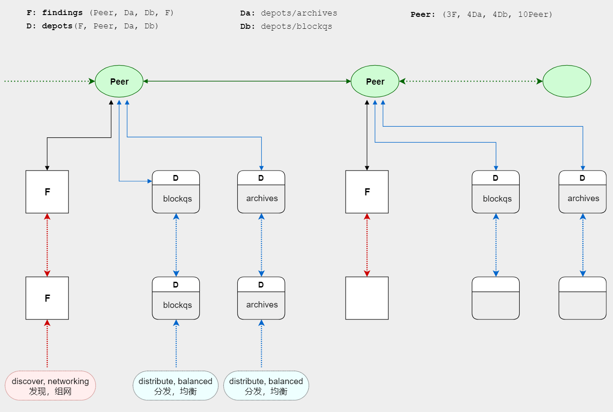

>
> 未来，人工智能会拥有强大的理性，任何中心化单位都会被说服或腐蚀，然而，如果这超级智能并不通往宇宙的真理，它就很可能将人类带往歧途。
>
> 唯有真正的去中心化……
>
> 一个去中心化未来的信用底层，隐含秩序、自由、和新的可能性～
>

# 区块链开放式架构设计

## 前言

Bitcoin是区块链世界的开创者，采用工作量证明（PoW）的共识模型。该模型简单有效，但运行至今已表现出一些不足：

1. **大量的电力消耗：**
哈希碰撞是一种强制消耗时间的运算，除了获得更大的胜出概率，缺乏更多的意义。并且这也是一种无限竞争的逻辑。

2. **垄断的中心化可能：**
高能耗促使矿池规模化运营以降低成本，大矿池的出现自然而然，但这也可能导致中心化的垄断。

3. **算力波动的影响：**
不同的区块链可能采用相同的矿机，算力切换或自然灾害都会造成算力的波动，这会影响系统出块的时间稳定性。

4. **缺乏时间确定性：**
靠碰运气的哈希竞争缺乏时间确定性，出块时间无法固定，这可能不是一个大问题。但如果时间能够固定的话会更好。

5. **庞大的数据负载：**
区块数据持续增长，存储和计算的成本也越来越高，在P2P模型下不是一个好消息。它不是PoW的问题，但依然是一个问题。

本设计试图克服以上这些缺点，创建出一个**能源节约、安全性足够、同时也有良好去中心化特性**的区块链架构，包括不同系统之间协作的机制和环境。欢迎参与讨论！

## 概要

### 信用的实体单元

在Bitcoin中，一笔交易由输入和输出构成，输入引用的是前一笔交易的输出，其合法性由输出的脚本实现验证。交易承载了比特币的流转，是资产权属的转移，本质上看，这是一种信用的传递。

人类社会的运行由信用驱动，而交易就可以视作这一驱动的数字实体。

### 由交易驱动的环境

信用在社会中广泛存在，融入在各种不同的传统体系里，这些体系通常是逻辑自完整，对外提供信用的接口。如果我们把交易看作信用的介质，区块链就是一个运行着信用的实体，它与传统的体系相互协作，安全可靠地传递信用。

在Web中，用户与页面的交互由一种称为**事件驱动**的模型提供。

这里，用户发起交易，交易携带意图，通过区块链传递到网络上的任何一个角落。或许，这可以称之为**交易驱动**的模型。

#### 链信用的独立性

一条区块链只能保证本链上的资产的安全，这是合理的，事物皆有边界，但这不妨碍信用在不同链间的传递。

#### 中间件的中介层

交易定义了权属在个体之间的转移。获取信息、构建交易并发送，在逻辑上这是私有的。因此，从一条链上获取信息创建另一条链上的交易并不涉及公共验证，也即：链间的信用传递实际上是私有自负责的。

由于边界的存在，两条链之间的交互就需要一个「交互者」的逻辑层，即中间件。

具体的工作方式可能是：中间件在一条链上注册监听，当监听的目标发生变化并触发行为时，中间件就可以执行自己的逻辑，譬如：

- 无人旅店中间件监听收款地址的收款，开启智能门锁。
- 税务系统通过预先发布的管理者交易，监听跳转过路信息并记录企业财务申报。
- 停车场系统中间件监听收款情况，驱动目标车位开启……
- 用户将A链代币兑换为B链代币，注册中间件监听对方行为，从而实现自动化处理等。

### 公共服务的网络

对于终端用户来说，区块链是一个P2P的服务网络，但现有的区块链系统负载过重，这影响了它提供服务的能力。实际上，区块链的逻辑可以分解出通用的几个部分：

- **节点发现（findings）**：作为一个基础服务，负责应用节点的登记、缓存、STUN服务。功能简单，独立组网。
- **数据驿站（depots）**：数据传输的中转和停靠，应当是一个容器，封装内部微服务的请求，实现数据的全网流通。
- **档案存储（archives）**：一个微服务，存储区块中交易携带的附件数据。可由数据驿站封装。
- **区块查询（blockqs）**：一个微服务，分离区块数据的存储负载，提供公共的查询服务。可由数据驿站封装。

它们可实现为独立的服务，功能简单稳定。服务之间自由连接交互，就可以形成一个去中心化的公共服务的网络。

#### 附：服务关系图

> **图解：** 
> 实线表示具体的连接，虚线表示抽象的泛连接（任意节点）。 
> `Peer` 表示作为应用的某区块链节点。详见后[《公共服务》](3.公共服务.md)部分。 

### 基于历史的共识证明

交易是既成事实的历史，无法篡改，而交易的ID拥有随机性，因此我们可以设计一个基于此的共识模型。它不需要工作量（PoW），非常廉价。与传统的权益证明（PoS）不同，交易ID只是一个哈希值，与财富无关，因此富者越富的情况可能会缓解很多。

用交易ID参与铸造竞争在逻辑上可以鼓励交易，而充足的交易费可以保证矿工的收益，这是一种正向的良性循环。

------------------------------------------------------------------------------

1. ### [导读](0.导读.md)
2. ### [共识模型-历史证明（PoH）](1.共识模型-历史证明（PoH）.md)
3. ### [共识模型-端点约定](2.共识模型-端点约定.md)
4. ### [公共服务](3.公共服务.md)
5. ### [激励机制](4.激励机制.md)
6. ### [脚本系统设计](5.脚本系统设计.md)
7. ### [脚本基础指令集（明细）](6.脚本基础指令集.md)

## 附录

- [附1.组队校验](附1.组队校验.md)
- [附2.攻击与安全（暂不重要）](附2.攻击与安全.md)
- [附3.概念集](附3.概念集.md)

## 脚本用例

- [链间兑换](examples/链间兑换.md)
- [存在性证明](examples/存在性证明.md)
- [链间授信](examples/链间授信.md)
- [批量付款确认](examples/批量付款确认.md)
- [网购支付流程](examples/网购支付流程.md)
- [实时税务](examples/实时税务.md)
- [版权登记](examples/版权登记.md)
- [侧链微支付](examples/侧链微支付.md)
- [选举子链（方案）](examples/选举子链.md)

-----------------------

*∬ 用逻辑设计程序，用代码书写逻辑，用程序表达自然*
