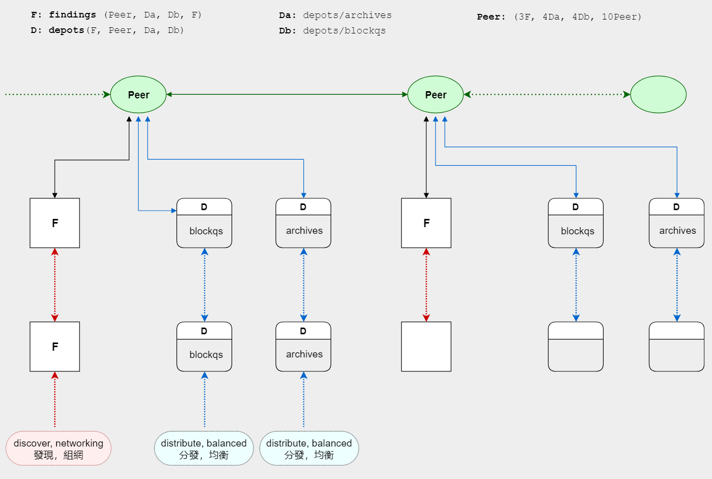

# 區塊鏈開放式架構設計

## 前言

Bitcoin是區塊鏈世界的開創者，自2009年1月3日啓動運行至今，已被世界上大多數國傢/地區所認識，其區塊鏈去除第三方信任和去中心化分布式網絡的價值已被普遍認可。但卽便如此，具體的技朮發展也依然在快速迭代和探索之中。

> 區塊鏈當前的共識方案已有幾個，主要的公鏈共識有：創始於Bitcoin的**工作量證明（PoW）**、源於Peercoin的**權益證明（PoS）**，以及Bitshares發明的**委托權益證明（DPoS）** 等。其它大部分共識設計基本上由此改進或組合而來，實質性的變化不多，這裏不作贅述。

Bitcoin采用工作量證明（PoW）共識模型。PoW是利用哈希運算結果的隨機性，讓節點用暴力碰撞來尋求目標難度的哈希值，最早成功的節點卽獲得區塊的鑄造權。當滿足規定難度的區塊被鑄造出來後，其它節點會抓緊時間開始新的哈希運算，創建新的區塊。

該模型簡單有效，但運行至今已逐漸暴露出來一些不足之處：

1. **大量的電力消耗：** 
哈希碰撞是一種強製消耗時間但無更多意義的耗能運算，節點靠PoW競爭理論上是一種沒有終點的邏輯（雖然存在暫時的某種平衡），長期看會是一個問題。

2. **壟斷的中心化可能：** 
高能耗促使礦池規模化運營，這可以降低成本，大型礦池的出現是自然的。但這引發了中心化的存疑，目前挖礦芯片的研發和生產就已經接近一種中心化了。

3. **算力波動的影響：** 
不同的區塊鏈可能采用相同的挖礦算法，切換算力到不同的區塊鏈可能讓礦工獲得更大的利益，這會造成算力波動，影響繫統的出塊時間和可用性。出於任何原因的礦機關停（如礦場事故）如果嚴重，也會帶來相同效果。

4. **缺乏時間確定性：** 
區塊鑄造依賴於缺乏時間確定性的哈希運算，出塊時間無法確定，這對挖掘和利用時間因子的價值不利，或許不是一個小損失。

5. **龐大數據負載的高門檻：** 
區塊數據會持續不斷增長，存儲和計算的成本也越來越高，全節點的硬件成本也會如此，這對於自由的P2P模型不是一個好消息。這不是PoW的問題，但它依然需要解決。

本設計試圖克服以上這些缺點，構建一種 **能源節約、安全性足夠、同時也有良好去中心化特性** 的區塊鏈繫統架構。成本下降甚至低廉，會帶來額外的好處：大規模部署更易行，區塊鏈融入社會的各方面也更容易。

## 概要

### 信用的實體單元

在Bitcoin的技朮實現中，一筆交易由輸入和輸出構成，當前交易的輸入引用前一筆交易的輸出，其合法性由輸出的腳本執行驗證。交易承載了比特幣的權屬和流轉，是資產的轉移，從某種角度看，這其實是一種價值表達，本質上是一種信用的傳遞。

人類社會的運行，離不開信用這一介質，它是一個社會最基礎的結構性要件，也是一種基本邏輯。它驅動着一個社會的運行，而交易就是這個基本要件的數字載體。

### 由交易驅動的繫統

在流行的HTML規範中，Web頁面由JavaScript腳本實現與用戶的交互，JavaScript采用一種稱為事件驅動的交互模型。

區塊鏈是一個信用繫統。信用在社會中廣泛存在，融入在各種不同的傳統體繫裏。這些體繫通常是自完整的，有着自己的邏輯環，對外或許有可信操作的接口，但卻不知道區塊鏈為何物，也卽它們隻是與信用相關而非區塊鏈技朮。

因此，我們認為區塊鏈更多的應當是去充當一種信用介質，連接社會溝通各方，而不是一個全能的超級平臺。

#### 鏈信用的獨立性

從目前的技朮實現上看，區塊鏈的信用是有界限的：隻能保證本鏈上資產的安全，卽自保證。

一條區塊鏈很難直接給另一條鏈提供安全，這實際上可以理解。無法跨鏈保護不等於信用不可以跨鏈傳遞，交易是權屬在個體之間的轉移，邏輯上是私有的，隻要中介環境可靠，輔以必要的約束結構（如過期贖迴腳本或法律訴訟），在不同的鏈間傳遞信用就是自負其責並可行的。

> 註：交易的雙方是具體的實體，物品的權屬必然有其受體，因此私有邏輯是基礎性的。 

#### 中間件的中介層

在兩條鏈之間加入一個自由的「交互者」邏輯層，卽中間件，是一種自然而然的方法。

中間件在一條鏈上註冊監聽，當監聽目標發生變化觸發對外行為時，中間件就可以執行自定義的邏輯：可能是在另一條鏈上創建交易，也可能是驅動一個不知區塊鏈為何物的傳統繫統，如稅務登記、機牀啓動或門禁開啓等。

這種中間件監聽驅動的機製就是區塊鏈作用於外部世界的模型：**用戶發起交易，交易驅動現實**。監聽的事件可能是目標地址的收付款及其確認：初始出現、首次確認、第n次確認，或者腳本執行時腳本指令自身的驅動行為。

因為解耦，中間件可以由任意語言實現，驅動任意的繫統。邏輯上，這種驅動是私有的：它們僅需部署在有目標需求的節點上。例如：

- 無人旅店中間件監聽收款地址的收款，開啓智能門鎖（進屋取卡）。
- 稅務繫統通過預先發布的管理者交易，監聽跳轉過路信息並記錄企業財務支出（假設一種新的監管方式）。
- 版權管理部門的中間件監聽版權聲明，提取信息檢査核實、錄入內部繫統或觸發其它行為。
- 停車場繫統中間件監聽收款和車位，驅動目標車位開啓可用。
- 用戶將A鏈代幣兌換為B鏈代幣，註冊中間件監聽對方行為實現自動化處理。

> 將區塊鏈的信用獨立出來作為一種外在的驅動力，是一種開放的架構，這裏的區塊鏈隻是一種有信用能力的第三方服務而已。
> 或許隻有這樣，區塊鏈繫統才能簡單穩定並富於效率。當然，一個特定用途的區塊鏈本身也可以是一個「類傳統功能」的繫統。

### 公共服務的網絡

對於終端用戶來說，區塊鏈是一個P2P的服務網絡，但現有的區塊鏈繫統負載過重，這影響了它們提供服務的能力。實際上，區塊鏈的邏輯可以分解出通用的公共部分：

- **節點發現（findings）**：作為一個基礎服務，負責應用節點的登記、緩存，提供節點相互連繫的信息。功能簡單，獨立組網。
- **數據驛站（depots）**：數據傳輸的中轉和停靠，可能實現為一個容器，封裝內部微服務的數據請求，實現數據的全網流通和交互。
- **檔案存儲（archives）**：一個微服務，存儲區塊中交易攜帶的附件數據。由數據驛站封裝，無需直接的網絡能力。
- **區塊査詢（blockqs）**：一個微服務，分離區塊數據的存儲負擔，提供公共的區塊査詢。同上由數據驛站封裝，自身無需網絡能力。

可以將它們各自實現為簡單的微服務，功能專一穩定，服務器之間自由連接，從而形成一個去中心化的公共服務網絡。這些公共服務網絡是通用的，任何區塊鏈都可以使用它們，這使得它們可以成為區塊鏈應用世界裏的基礎設施。

#### 附：服務關繫圖

> **圖解：** 
> 實綫表示具體的連接，虛綫表示抽象的泛連接（任意多個節點）。 
> `Peer` 表示作為應用的某區塊鏈節點（詳見後《公共服務》部分）。 

### 概率證明（PoP）共識模型

這是利用交易ID的隨機性設計的一個基於**概率證明**（PoP: Proof of Probability）的共識模型，簡單並很可能廉價。出於輔助性的價值考慮，也收納了交易的幣權（`幣量x幣齡`）因子作為二級評選工具。

1. **一級篩選**：交易ID與目標區塊哈希的相似性（相位差和）對比，低者勝。
2. **二級篩選**：交易的幣權大小（輸入中 `幣量x幣齡` 的合計），高者勝出。
3. **三級篩選**：僅為最終唯一性目的，取一級篩選中的某個哈希值簡單比較卽可。

這樣的設計有如下優點：

1. 與傳統的PoS權益證明不同，交易ID隻是一個數據哈希，與財富無關，幣權僅作為次級因子，這使得富者越富的情況不再嚴重。
2. 用交易ID實現鑄造競爭會鼓勵交易，大量的交易費能夠保證礦工的收益，這創建了一個正向的良性迴饋。
3. 歷史交易的數量鉅大，如果每區塊包含 `64k筆` 交易，則 `20萬` 區塊長度內競爭者規模可達百億，51%攻擊幾乎不可能。

> 詳情請參考下面目錄裏相應鏈接的文檔。

### 小結

宏觀上看，我們認為區塊鏈的邏輯不應當是一個平臺。平臺是大地的內涵，創生一切也主宰一切，毫無疑問是一個中心。

在這個現實世界裏，還有流動的空氣、熱力學的動能、無形的市場驅動力……在我們看來，區塊鏈的信用應當是一種力量、動能，擁有驅動這個社會運行的能力，甚至塑造人類與機器的關繫。

最後引用拜占庭將軍的問題：將軍們現在終於有了一個可靠的信令繫統，可以協調一致，去完成那本不可能的任務。

------------------------------------------------------------------------------

1. ### [序言](0.序言.md)
2. ### [共識模型-概率證明（PoP）](1.共識模型-概率證明（PoP）.md)
3. ### [共識模型-端點約定](2.共識模型-端點約定.md)
4. ### [公共服務](3.公共服務.md)
5. ### [激勵機製](4.激勵機製.md)
6. ### [腳本繫統設計](5.腳本繫統設計.md)
7. ### [腳本基礎指令清單](6.腳本基礎指令清單.md)

## 附錄

- [附1.組隊校驗](附1.組隊校驗.md)
- [附2.攻擊與安全](附2.攻擊與安全.md)
- [附3.概念集](附3.概念集.md)

## 腳本用例

- [鏈間兌換](example/鏈間兌換.md)
- [存在性證明](example/存在性證明.md)
- [鏈間授信](example/鏈間授信.md)
- [批量付款確認](example/批量付款確認.md)
- [網購支付流程](example/網購支付流程.md)
- [實時稅務](example/實時稅務.md)
- [版權登記](example/版權登記.md)
- [側鏈微支付](example/側鏈微支付.md)

這是一個開放的愛好者項目，歡迎您的參與 `(^,^)`
