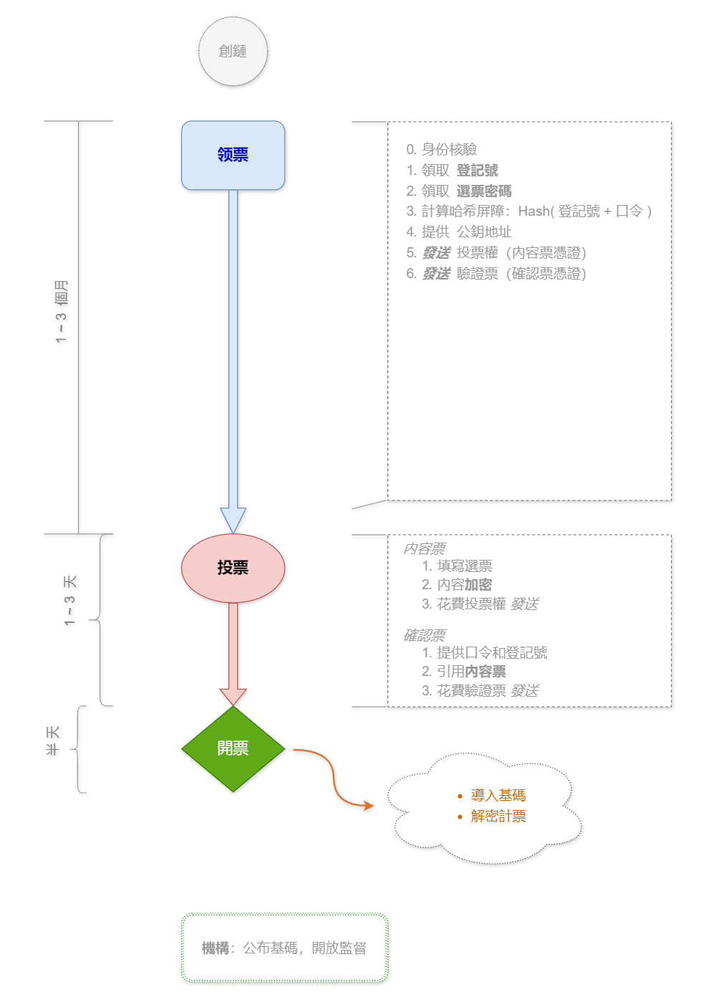

# 选举子链设计

在公共的主区块链上创建一条附生的子链，实现选举的各个逻辑环节，获得开放的监督能力和无可置疑的安全性。这是一种理想且节省成本的选举实施方案。

大体上，有 `4` 个选举阶段贯穿于选举流程，它们分别是：

1. __领票__：选民携带有效身份证件到规定的派票点获取当期选举的投票权。这可能在投票开始前 `3` 个月就启动了，以方便异地选民。
2. __投票__：正式开始填写选票内容并发送到子链网络上。内容会加密，视投票规模和网络处理能力，可能需要 `1-3` 天时间。
3. __开票__：结束投票开始点票，由计算机自动计算并公示。此时会解密选票内容，所需时间视计算机能力和公示设计而定，一个白天应已足够。
4. __监督__：区块链数据是开放可任意获取的，民间任何机构和个人都可以实施监督（选票密码将可知）。可能需要保留足够的时间用于监督反馈。

__流程示意图__




## 创链

选举子链起源于主链上的一笔交易，包含了派票机构的资格公钥。当交易被主链某区块收录后，此区块即成为子链的创始区块，而该交易也就是该子链的起始交易。

接下来就可以创建投票用的 __投票权__ 交易和 __验证票__ 交易。这是在选民登记参与投票时，由官方相应机构创建和签发的。


## 派票/领票

选民可以凭有效的身份证件到派票点登记参与投票、领取投票权。

投票权实际上就是一笔投票凭证交易，由起始交易里列明的资格公钥的私钥签发，包含了预定格式的投票内容参考或指引。该凭证将发送到登记选民的个人钱包的公钥地址上。网络会验证投票凭证的合法性，即区块链中只会包含合法的投票凭证。


### 登记号

选民登记后应当获得一个登记号。登记号用于隔离选民真实身份与当期选举投票内容（选票）之间的关联，这是一种隐私保护。

登记号可能是一个 `16` 字节的随机字符串，全局唯一（每个登记号都不同）。


### 用户口令

选民获取的投票权被发送到选民自己的公钥地址上，在没有其它保护因子的情况下，攻击者如果获得了该公钥的私钥，即可冒充该选民投票。这会造成投票竞争（相同身份的多张投票），可能成为一种攻击方式。

这里加入一个保护因子：__用户口令__。它由选民自己构造，逻辑上就像普通的个人密码。主要用于验票交易里的哈希屏障（一种强化安全措施），详见下。

> __注：__
> 保护选票的因子其实还有选票密码，这是必需的。


### 验票交易

验票交易是投票确认交易的凭证，与投票权交易一同创建，用于选民最终投票内容的验证、解密、读取和统计等。

验票交易的脚本里包含了一段前置的验证指令，它是一个哈希屏障：`Hash( 登记号X + 口令X ) == 结果序列`，其中 __结果序列__ 由用户自己计算并提交给派票方（以创建验票脚本）。`登记号X` 和 `口令X` 为脚本的解锁参数，在选民投票时提供。其中：

```go
登记号X = Hash( 登记号 )
口令X   = Hash( 口令 )
```

即：结果序列 = `Hash( Hash(登记号) + Hash(口令) )`。

登记号对派票机构为已知，但用户口令为选民个人私有（不公开）。

> __注记：__
> 用户对口令的选择往往有习惯性，这种习惯不应当被暴露。所以上面哈希屏障里使用的是口令的哈希结果而非口令本身。
> 登记号虽然是一个随机序列，但它会用于计算选票与选民身份之间的关系，不应当被收集。所以也需要进行一次哈希封装。


### 选票密码

选举子链由一个开放的P2P网络运行，选票在投票期间发送到了链上，数据是公开的，因此在开票之前选票的内容需要加密。

选票密码是一个由派票机构创建的对称密钥，它需要对每个登记的选民都不同，同时，这个密钥还应当既方便保存又不容易泄露。设计是这样的：

`选票密码 = Hash( 基码 + 登记号X )`

其中 __基码__ 是一个长 `32` 字节的随机序列，在当期选择中固定不变，由派票方的上级机构或专门组织保管（因此选票密码也需要由他们构造）。因为每个选民的登记号不同，所以哈希出来的密码也不会重复。

选票密码会发给登记的选民自行保管，派票机构无需也不应当保存它们，如果用户丢失密码，可以到派票点验证身份后申请再次构造（需提供登记号X）。

> __注：__
> 投票时选民会提供自己的登记号X，开票方可实时构造密码来解密投票内容。
> 出于开放监督的目的，开票后开票方需要公布基码，这样任何人就都可以查看选票内容并核实了。


### 小结

#### 选民提供的数据

- 身份证件：用于派票点验证选民的合法性，这是社会性的工作（与选举子链无关）。
- 公钥地址：用于接收投票权和验票交易。
- 用户口令：用于构造选票验证序列，是隐式间接提供（计算因子）。


#### 选民收到的数据

- 登记号或登记号X：一个不算短的随机字符序列，可能需要书写保存或发送到手机存储。
- 选票密码：一个 `32` 字节长的随机值序列，可能派票方用二维码方式提供。对于对称加密来说，这样的长度已足够。


### 附：安全性

#### 登记选民ID库

选民登记领票时，派票方应当有一个临时的数据库用于存储领票人信息，保存选民与选票的关联并避免重复领票（作弊）。选票并不直接与选民的真实身份ID相关，每张选票通过一个登记号与选民建立连系，同时，这种连系还必须是隐式的：

`选民ID = Hash( 身份ID + 登记号 )`

其中身份ID是选民的真实身份标识，如：身份证号、社会保障卡号等。登记号则是一个16字节长度随机值序列（注意此处使用的是 __登记号__ 本身）。为了简单核实某身份ID是否已经领票，选民ID条目还需要对应一条 `Hash(修饰码+身份ID)` 字段。其中修饰码为当期选举的一个固定标识。

> __注：__
> 修饰码主要用于动态化不同选期的身份ID值，让固定的身份ID没有确定性。

身份ID与登记号建立关联是必要的，这使得如果选举后需要进行作弊调查，调查机构可以由合法身份ID的白名单遍历碰撞计算出合法的登记号，从而过滤出非法的选票。

另外一方面，关联的隐蔽性也是需要的，这是一种隐私保护：如果攻击者想要知道某人的投票内容（已知其身份ID，找到登记号），或者想知道某选票的投票人（知道登记号，找到身份ID），攻击者需要同时获得两个数据库才行：前者需要选民ID库和登记号库，后一种情况需要选民ID库和身份ID库。

如果派票方发给登记选民的是 `登记号X`，隐藏了登记号本身，则后一种攻击还需要同时获得登记号库才能实施。__注__：都必须采用遍历计算碰撞发现。


#### 登记号数据库

选民的登记号应当用一个独立的数据库存储，数据库内不包含任何与选民真实身份相关的信息（即：它就是一个单纯的序列号库）。数据库应当由选民ID库保管者之外的机构掌管，这样才能让攻击者同时获得两个数据库的难度增加。登记号库也应当是临时的，选举结束后即销毁。

登记号可以由派票点在核实领票人身份且尚未领票后，向登记号管理方获取。即登记号管理方为后台服务，不与选民接触。

派票点交给选民的可能只是登记号的哈希结果（即 `登记号X`）而非登记号本身。


#### 重启投票

如果因为选举舞弊或其它复杂情况而需要重启选举，可以由调查机关整理出合法的登记号，过滤出合法的公钥地址并重新发送投票凭证即可。

如果有尚未登记的选民希望参与重投，则可以按原始流程进入：登记领票、投票。

如果有登记并已经领取投票权的选民并未实际投票而此时希望参与重投，则需要在调查机关整理出公钥地址之前发送旧的投票，以便于自己的公钥地址被纳入合法清单。或者，像未登记选民一样亲自到派票点提供公钥地址，获取新的投票权。

所以，重启投票其实并不难（成本不高）。


## 加密投票

为了避免私钥和密码泄露带来的选票竞争攻击，投票分前后两笔不同的交易完成：

- 第一笔为 __内容票__。包含具体的投票内容，需加密。
- 第二笔为 __确认票__。在内容票进入区块后发送，确认前一笔的内容票。此时会提供口令哈希和登记号X用于验票和解密辅助。


### 内容票

根据投票凭证交易里的内容参考或指引创建投票内容，加密后发送到选举子链网络上。

此阶段仅仅只是发送已加密的投票内容，并不立即提供登记号和口令信息
> __注记：__
> 内容票上不应当提供登记号以便于开票解密，因为攻击者可能已经获得了基码，此时便能构造密码解密查看内容，从而决定是否发起投票竞争。
> 登记号在后一步的确认票中提供，这样即便攻击者能够解密查看内容，但已经无法发起投票竞争了（先进入区块的内容票有效）。


### 确认票

逻辑上是对前一笔已经进入区块的内容票进行确认。它会 __花掉__ 验票交易，提供口令哈希和登记号哈希来越过哈希屏障，同时也提供内容票的区块号和交易ID，让验票交易可以读取内容票的内容并执行计票统计。

越过了哈希屏障且签名合法的确认票被视为合法，收入区块。此时并不立即读取内容票的内容（内容已加密，基码未知无法构造解密密码）。


## 解密开票

当投票结束后，开票过程即可开始。开票实际上是对区块链中的确认票重新验证执行一次，但此时会预先导入基码，当执行验票过程时即可实时构造密码解密选票内容，完成计票统计过程。__注__：构造密码依赖于登记号X，因此错误的内容票指引是无效的（密码不同无法解密）。


## 监督

区块链网络是P2P方式的，区块数据会存放在所有的节点中，因此任何节点都可以执行开票过程，前提是知道基码。如果实施开放的监督，选举机构可以在开票后公布基码（或许适当延迟）。登记号X存在于选票数据中，但它与选民的关系极其隐蔽（如前设计），所以开放解密不应该是一个问题。


## 作弊与安全

区块链的安全性是无可置疑的，但这仅限于区块链自身，或者说区块链上的事务。除了链上的部分外，选举还包括链外的事情，比如派票的身份核实、基码的安全保存、最后计票统计是否开放监督等。

因此这里主要针对链外部分进行分析，并提出可能的解决办法。


### 假票

在区块链上没有假票，这里的假票是指用无效的身份ID登记获取投票权。票权本身是真的，但选民是假的。

出现这种情况只能是派票机构（派票点）的疏忽或 __有意合谋__，直接的技术措施不适用于这里，但可以通过在派票点设置监查员来减少这种情况，或者在派票过程中由监查机构抽查检测选民ID库来及时发现非法身份ID。

> __参考：抽查方法__
> 1. 首先制作合法选民身份ID的哈希清单（即：`Hash(修饰码+身份ID)` 表）。
> 2. 随机抽取选民ID库表条目，核实其中的 `Hash(修饰码+身份ID)` 字段是否合法。

或者，如果选民ID库的保存是完整安全的，调查机构可以在后期汇集几个数据库（`选民ID库`、`登记号库`、`身份ID库`），遍历计算找出假票。

> __参考：调查方法__
> 1. 同上抽查方法提取出全部合法身份ID（用到 `身份ID库`）的选民ID（用到 `选民ID库`），建立 `身份ID => 选民ID` 的映射集。
> 2. 对每一个选民ID遍历 `登记号库`，计算等式 `选民ID = Hash( 身份ID + 登记号 )` 碰撞发现其登记号，建立 `身份ID => 登记号` 的映射集。
> 3. 对合法的登记号计算 `登记号X = Hash(登记号)`，在区块链中找到相应的选票，它们是合法的。


### 代票

代票是指别人代为填写发送的选票。该行为本身可能是合法的，因为肯定存在不会使用投票App或无法使用或其它原因的选民。如果代为投票是遵循了原选民的意愿，只是代为填写和发送则应当没有问题。

代票不是一个技术概念，只是一种世俗的逻辑，代为填写的选票与正常的选票无任何区别（没有标注选项）。

代票可能会成为一个问题，如果有人花钱购买别人的选票（私钥/密码/口令/登记号）或通过欺骗获得，则将有损于选举本身的含义。没有技术措施可以防范这一情况，只能依靠现有的社会准则（司法、道德）来避免或弱化这种问题。


### 窃票

不是每一个合法的选民都会登记领票参与投票，因此可能会有人盗用别人的身份冒领票权。这里的身份ID是有效的，因此不算是假票。

出现这一情况可能源于选民身份ID库（政府已有）的失窃，以及派票点核验身份的宽松（非本人也可领票）。要解决或缓减这一问题可以有一个方法：在投票结束后但销毁选民ID库之前，开放该选民ID库，让选民可以自己查询自己是否为已登记。

> __注：__
> 选民ID库应当只能查询不能遍历，派票方公布修饰码，选民提交自己的 `Hash(修饰码+身份ID)` 即可简单完成查询。

如果选举结果直观地出人意料，而这一结果又影响巨大，未参与投票的选民可能也会关心了。这样，未参与登记投票的选民就可以发现自己是否被盗用了身份。

身份ID并不是明码保存在选民ID库里的，而且提交的也只是一个哈希值，所以不会有隐私的问题。


### 泄密

选民接收投票权的公钥地址的私钥，或者得到的密码、登记号或者口令等可能泄露。这种泄露是个体性的，不会影响到他人，因此危害并不大。而且需要泄露选票全部的关联信息才会导致投票问题（也只是一种投票竞争而非代替）。

真正有危害的是派票机构保存的基码的泄露，但这种危害也仅限于让攻击者能够在开票之前看到选票的内容，而无法盗取选票。提前知道选票内容可能会扰乱正常的投票秩序，譬如攻击者建立了一个实时公布内容的系统，扰乱选民投票意向。

保护好基码是必要的，它应当由派票管理机构（而不是派票点）负责，派票点应当通过内部的渠道向管理者请求获取选民的选票密码。


### 隐私保护

选民个人的真实身份ID不应当与选票内容关联起来，这是尊重选民个人内心选择的基本道义。

在本设计中，派票点/派票机构的数据库中并不直接存储这种身份关联。因为投票需要可追溯（调查），所以需要建立某种关联。这里是采用提高难度的方式：攻击者需要获得不同机构异地存储的 `2~3` 个不同的数据库，并通过大量计算（碰撞）才能发现这种关联，而有些数据库是临时的。


### App安全

区块链网络是P2P方式运行的，投票的客户端App是由选民自己使用，但依然存在舞弊的可能：如果客户端在发送投票内容时悄悄篡改了内容，普通用户并不容易发现，当然可能会有专业人士侦测检查曝光，但这依然是一个问题。

一个良好的策略是使用开源的客户端App，并且App的工作方式应当避免管得太多，适当留出某些环节让用户可以加入复核。比如让加密内容的环节独立出来，客户端不作干涉，客户端仅对 __已加密__ 的数据进行签名和发送不会带来问题，如果它们不知道密码的话。


### 网络攻击

选举子链需要由不定数量的P2P节点组网运行，如果攻击节点多于正常节点，会导致区块链分叉，从而带来一定程度的混乱。合法的支链依然是合法的，它们得出的结果也是正常的，但如果合法节点太少，攻击节点可能会阻断合法节点之间的连系，从而导致网络难以良好运行。

这种情况应该很难出现，就如普通区块链网络的运行现状。如果选举机构拿出适当的激励（有币运行），经济利益的驱动可能会让网络更有意思。


## 附注

### 子链运行

如果选举机构有运行子链网络的开支预算，可以采用有币激励的机制运行，鼓励个体节点参与组网和交易校验。

如果选举机构预算贫乏但民众热情，则可能以无币的方式运行，极端情况下，选举机构可以仅仅只用一台计算机参与，并负责最后的开票和公告即可。


### 组织机构

- __派票点__：<br>
    接待、核实选民；<br>
    向技术服务处获取 __登记号__，让选民构造哈希屏障 __结果序列__；<br>
    向技术服务处提交申请创建选民 __投票权__ 和 __验票交易__；<br>
    用登记号哈希向派票管理者获取 __选票密码__。<br>
- __派票管理者__：<br>
    派票点的上级管理机构，也是保存 __基码__ 和生成 __选票密码__ 的地方。<br>
    注意基码是开票解密的基础，需妥善保管。<br>
- __技术服务处__：<br>
    发放和保存选民 __登记号__；<br>
    创建/发送 __投票权__ 和 __验票交易__。<br>
    __注__：应相对独立以保障安全。该处并不接触选民的真实身份信息。<br>


### 客户端App

选举子链是在每一次选举开启后创建的，选举结束后该子链就完成了任务，不再需要了。

选举子链的客户端包含了区块链网络运行的基本能力，但有一些特殊之处：__创始区块__ 和 __起始交易__ 是可配置的。这样，在每一次选举开始后，客户端就可以通过简单的配置即可投入使用。


### 腳本參考

4种交易（投票权、验证票、内容票和确认票）的详细说明和脚本代码请参考 [脚本清单](election/脚本清单.md)。
