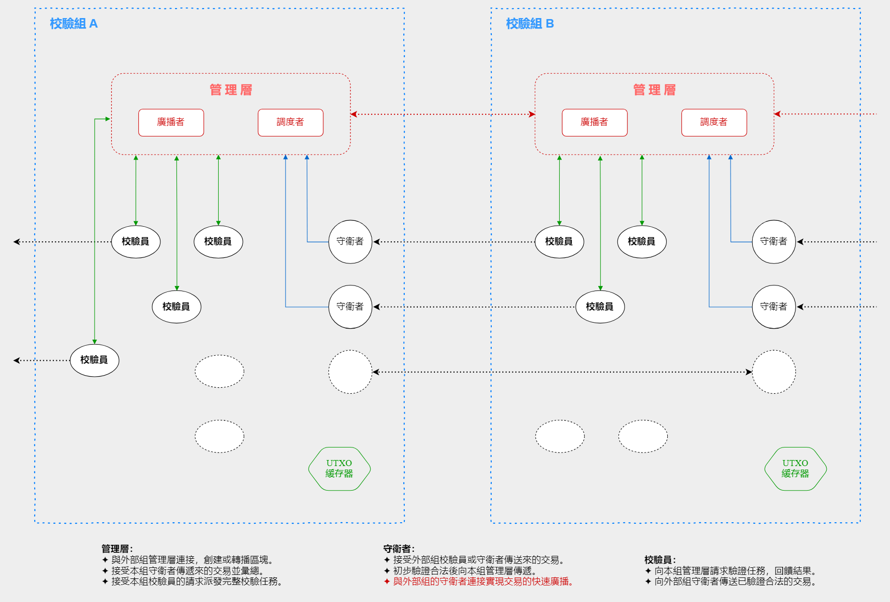

//////////////////////////////////////////////////////////////////////////////
Copyright (c) 2019 @cxio/blockchain

    Permission is granted to copy, distribute and/or modify this document
    under the terms of the GNU Free Documentation License, Version 1.3
    or any later version published by the Free Software Foundation;
    with no Invariant Sections, no Front-Cover Texts, and no Back-Cover Texts.
    A copy of the license is included in the section entitled "GNU
    Free Documentation License".
&&&&&&&&&&&&&&&&&&&&&&&&&&&&&&&&&&&&&&&&&&&&&&&&&&&&&&&&&&&&&&&&&&&&&&&&&&&&&&

## 組隊校驗

### 前言

緣於去中心化的端點獨立性，區塊鏈的工作邏輯實際上是「單機」。如果交易量太大，性能不足的機器是無法成為一個正常的節點的。這也是當前區塊鏈繫統交易規模受限的原因之一。去中心化的單機模型擁有龐大的冗餘性，排除分權的需求（已經過剩），這樣的冗餘實際上是一種浪費。因此，多個端點協同工作，分擔負載並共同組成為一個邏輯上獨立的單元是有意義的。

實際上，交易天生就擁有獨立的邏輯，一筆交易就是一些信用完整轉移的過程，擁有獨立的可驗證性（除了部分跳轉指令需要進階驗證）。一個端點可以最少僅驗證一筆交易，不同的端點驗證不同的交易，配合恰當的分工管理和冗餘復核保證，多機協作共同完成一個區塊全部的工作是可能的。

**基本原則**

一個協同工作的組隊稱為一個「校驗組」，是一個邏輯上的單體。組內以**冗餘校驗**和**擴展復核**為保障，避免噁意端點行為造成的錯誤。不同的校驗組之間同步區塊時，會卽時迴饋錯誤的交易ID，這樣就可以實現錯誤的快速封堵和及時糾正彌補。

- 身份標識。端點以區塊鏈地址為身份，用於身份識別和收益分成。
- 自由組隊。一個端點可以自由加入任一校驗組，能力強的單機也可以同時加入多個組。
- 半開放性。因為涉及部分信任的問題，可能需要註冊（微礦池）。

### 4種角色分配

1. **管理層**：負責組內交易校驗工作的分發（冗餘控製）、合法交易匯總、節點業績記錄，以及與外部的區塊交互等。
2. **守衛者**：接收外部傳入的交易，執行「首領校驗」，提交驗證通過的交易到管理層，並傳遞給其它組的守衛者。
3. **校驗員**：向管理層請求交易執行完整校驗，無論結果如何都向管理層提交反饋，同時向其它組的守衛者傳送校驗合法的交易。
4. **UTXO緩存器**：緩存當前UTXO集合並提供査詢服務，是組內的公共服務，用於雙花檢査和降低參與者的硬件門檻。

#### 管理層

管理包含兩種基本職能：**廣播**和**調度**，它們收集並緩存從守衛者那裏提交上來的準合法交易（僅通過首領校驗），接受校驗員的申請，派發交易的完整校驗任務。如果組內有成員擁有鑄造資格，則與鑄造者協作構造區塊並廣播出去。

管理層與外部其它校驗組的管理層建立連接，形成一個以校驗組為單元的管理者P2P網絡。

**廣播：**

- 打包交易構造區塊，接收組內鑄造者的Coinbase交易，驗證其合規性。
- 如果本組擁有鑄造區塊的資格，收錄Coinbase交易，提供交易哈希樹根供鑄造者簽署。計算區塊頭，向網絡廣播區塊。
- 如果本組沒有鑄造資格，接收並驗證其它組發布的區塊，卽時迴饋和中繼。
- 參與組內成員鑄造預選時的擇優池交互和同步（因為管理層是內部成員聯繫的中介）。

**調度：**

- 接收組內守衛者傳入的經過首領校驗的交易，存入待驗證交易池。
- 接收校驗員的工作申請，檢索待驗證交易池派發完整校驗的工作（傳送交易數據）。
- 接收校驗員的驗證結果反饋，評估/執行必要的復核管理工作（按設定的冗餘度派發給其它校驗員）。
- 存儲已經確認合法的交易集，向廣播機同步。
- 記錄組內各成員的工作業績，用於最終酬勞評估。

**連接關繫：**
> 組內：守衛者、校驗員。 
> 外部：其它校驗組管理層。 

#### 守衛者

除了與本組的管理層建立連接之外，更重要的是與其它組的守衛者和校驗員連接，接收它們傳入的交易，做簡單的首領校驗。
首領校驗為初步驗證（見下），合法的交易被傳遞到管理層和其它組的守衛者（以實現交易的快速廣播）。

一個校驗組中，僅有守衛者接收從外部傳來的未驗證交易，它們充當交易進入本組的大門護衛。
因為交易未經全面驗證，為預防噁意的行為，守衛者需從管理層獲取交易黑名單（首領輸入合法但其它輸入非法的交易），以屏蔽噁意行為的影響。

**連接關繫：**
> 組內：管理層。 
> 外部：守衛者、校驗員。 

#### 校驗員

向管理層請求校驗任務，執行交易的完整驗證並反饋結果。與其它組的守衛者建立連接並提供驗證合法的交易。

校驗員羣體需要較大的冗餘度，管理層通過冗餘復核的方式儘量排除成員錯誤反饋的噁意行為。
待驗證的交易是初次驗證還是復核驗證對校驗員來說是透明的（不知情）。

**連接關繫：**
> 組內：管理層。 
> 外部：守衛者。 

#### UTXO緩存器

由於交易被分散校驗，雙花檢査就需要由緩存服務器來提供。通常，守衛者和校驗員對UTXO的請求包含來源交易ID，如果交易驗證通過，該ID就會被緩存器記錄下來，雙花交易就可以被發現了。緩存器會根據規則判定雙花交易可否放行（時序保障），然後通知給請求者。

一名搗蛋者可能向緩存器提供假ID以製造假雙花，所以緩存器在雙花出現時還需要與管理層協作，判斷前一個交易ID是否眞實。如果搗蛋者需要完成搗蛋，就需要同時欺騙管理層，但這樣就會被檢査出來。或者，管理層也可以從緩存器處獲得更多信息。

另一方面，UTXO緩存對一個單獨的守衛者或校驗員來說，可能是一筆不小的開銷。內部公共的UTXO緩存服務是劃算的，服務器也不需要太多，2-3個的冗餘度應該已經足夠。因為當前時段的交易是明確的，緩存的命中率實際上很高。

**連接關繫：**
> 組內：守衛者、校驗員、管理層。 
> 外部：無（非指blockqs公共服務）。 

#### 附：首領輸入與首領校驗

為了支持交易儘快地在網絡上傳播，便於全網更有效率的處理交易，端點對於接收到的交易，僅驗證其首筆輸入是否合法。該首筆輸入卽稱為首領輸入（Leader TX），僅驗證首領輸入的行為稱為首領校驗。

為了避免攻擊者構造大量首領輸入合法但後續輸入非法的交易實施洪流攻擊，這裏有一個簡單的約束和一個黑名單抑製措施：

- **約束**：首領輸入必須是全部輸入裏幣權最大者。
- **抑製**：完整校驗失敗的首領輸入會進入黑名單。

**安全性**

統計全部輸入的幣權需要査詢UTXO緩存服務器，因此攻擊交易裏的後續輸入必須使用有效輸出。攻擊者可以使用別人的低幣權交易（無需正確簽名）充數，但這在校驗員處會很快被檢査出來，並不能帶來更多的負載消耗。而如果儘量采用自己控製的輸出（僅一筆非法卽可），則必需滿足首領輸入幣權最大的要求，如果這些首領輸入被納入黑名單，連續的攻擊就很難實施。

考慮容忍偶爾的失誤，進入黑名單並不是永久的，這個期限可能在3天以上。如果這是一個失誤，或者攻擊者想要花掉這筆輸入，他們要麽等待有效期過後，要麽可以將之編入一筆有更高幣權首領輸入的交易裏。這是允許的。

> **註意：** 
> 首領校驗隻是交易快速傳播的一種策略，由校驗組的守衛者實施。 
> 首領輸入幣權最大的規則，並不在交易進入區塊的最終合法性規則裏。 
> 首領校驗包含對雙花的「時序保障」處理，以配合零確認的安全機製。 

### 校驗的冗餘度與可靠性

#### 冗餘校驗

同一筆交易由多名校驗員執行完整的驗證（含首領輸入），如果校驗員全都反饋為合法或非法，則視為合法和非法，如果其中至少有一名判斷為非法，則納入擴展復核的範圍。通常，校驗員的冗餘度不低於3，卽一筆交易會交由3名以上的校驗員驗證，但這也取決於校驗組自己的權衡。

#### 擴展復核

對於在冗餘校驗裏得到部分非法判斷的交易，管理者會將它們重新派發給另一些校驗員驗證。這就是擴展復核。為了獲得足夠的可靠性，除了依然保持必要的冗餘度外，這裏還設計了兩級復核機製：

- **一級復核**：報錯者為零，交易視為合法。報錯者超過半數，交易視為無效，低於半數，則進入二級復核。
- **二級復核**：如果有一名校驗員報錯，交易卽視為無效。通常，二級復核的冗餘度不高，且多交給信譽度較好的校驗員執行。

在一個校驗組中，二級復核判斷為非法的交易並非就再也沒有機會重審了。如果這筆交易實際上是合法的，它就很可能在其它校驗組裏也合法，而如果它被打包進了區塊裏，當區塊同步到當前組時，這筆交易就會被重新認眞驗證。

> **註記：** 
> 算法可能並不需要記錄校驗員驗證了哪些交易，而是隻需要借助於隨機分派任務卽可。 
> 更多的校驗員可以產生更好的隨機性，這可能是一個正向因子，可以促進更多廉價客戶機的參與。 

### 鑄造者預選與鑄造約束

組隊校驗模式下的校驗組是一個邏輯獨立的單元，但這並不表示這個邏輯單元的連網也是個體形式（單獨的連入連出）。相反地，各組成員之間的連接實際上幾乎是完全自由的，它們隻有一些簡單寬泛的角色約束，這是一個擁有微規則但依然P2P的網絡。

所以鑄造者的預選並不需要特別的適應設計，如前規則依然適用。唯一的增強是管理層參與本組鑄造預選數據的傳遞，因為組內成員之間是沒有連接的，管理層是所有組員共享信息的結點。

組內成員是否擁有鑄造區塊的資格，管理層不一定預先知道，一位鑄造者也可能參與了多個校驗組同時工作，因此鑄造者簽名哪個校驗組的區塊並不確定。另外，鑄造者也可能同時簽署多個校驗組的區塊，而這些區塊並不相同，這會帶來混亂。

#### 多簽約束

鑄造者簽署多個區塊的原因可能是不清除所簽區塊的收益，或者後來的區塊打包了更多的交易，收益增加讓鑄造者有了重新簽署的動機。不清楚收益的多簽帶來混亂，而更多收益區塊的重簽則會影響區塊的正常出塊。因此需要一個規則來製約或篩選多簽的區塊。

**規則：收益最低的區塊勝出，進入區塊鏈。**

這是一個簡單的規則，但它可帶來如下效果：

- 鑄造者趨向於儘量晚簽署區塊，以儘可能多地收集交易。但受製於交易的傳輸約定，簽署會在恰當的時間執行。
- 鑄造者會主動避免多簽，因為如果後一次簽署的區塊收益更低，反而帶來損失，而如果收益更高卻也無用。

#### 信息分離的約束

Coinbase交易負責構建激勵的分配，一個校驗組中的激勵分配通常是有要求的，比如要求把奬勵發送到管理者掌控的地址，以便於管理者最後按勞分配酬金。因此除了符合通用的規則外，Coinbase交易也不能隨意構建，管理層需要檢査交易是否符合要求。這就是交易哈希樹根需要簽名的原因。見如下圖示：

交易的四元鏈哈希樹根（Root）和UTXO指紋由鑄造者簽名，然後簽名數據與被簽名數據一同計算區塊驗證根（CheckRoot）進入區塊頭。

UTXO指紋可以從組內的UTXO緩存服務器（或區塊査詢服務網）獲得，因此管理層對鑄造者唯一的製約是交易的哈希樹根信息。鑄造者是離散的校驗員或守衛者，它們沒有全部交易的ID集合，因此正常的鑄造流程是：

1. 鑄造者構造Coinbase交易，向管理員提交，申請簽署。
2. 管理員選擇最優的申請者，驗證其Coinbase交易的酬勞分配是否合規。
3. 合規則添加Coinbase交易的ID到交易ID集，構造交易集的哈希校驗樹根，提供給鑄造者簽署。
4. 鑄造者簽署數據（Root+UTXO指紋），提交給管理層同時也自行發布。

> **不足之處：** 
> 普通組員鑄造者有管理層的製約，但若管理者本身就是鑄造者，則無法監督了。 
> 管理者需要招募組員參與工作，或許信譽作為一個市場因子稍有作用吧？ 

### 關於最優規模

一個校驗組的規模並不是越大越好，相反，這個規模需要適度輕量，恰到好處。單個區塊的交易量是有限製的，如果按最多64k筆交易，每秒處理182筆交易的規模估算，由50-80個客戶機組成一個校驗組可能就綽綽有餘了。

由校驗組構建的區塊鏈網絡是一個有着某些「微結構」的P2P網絡，端點對交易驗證的認領是自由的，能力強的可以多處理一些，反之則量力而行，這是一種自適應的模型。端點加入哪個校驗組或多少個校驗組也是自由的，基本上，這是一種自由市場的模式，擁有良好的去中心化特性。

-------------------------------------------------------------------------------

上一篇：[腳本基礎指令清單](6.腳本基礎指令清單.md) 
下一篇：[附2：攻擊與安全](附2.攻擊與安全.md) 
