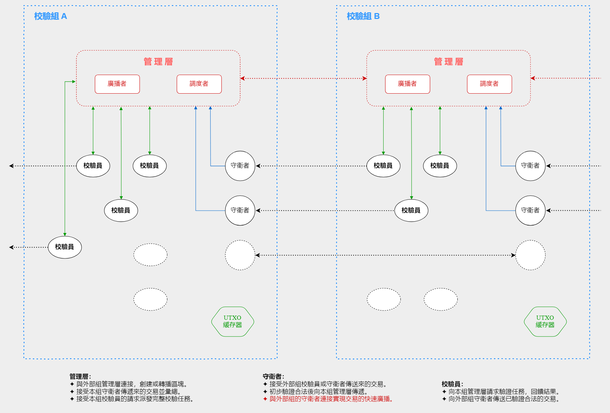

//////////////////////////////////////////////////////////////////////////////
Copyright (c) 2019 － 2024 @cxio/blockchain

    Permission is granted to copy, distribute and/or modify this document
    under the terms of the GNU Free Documentation License, Version 1.3
    or any later version published by the Free Software Foundation;
    with no Invariant Sections, no Front-Cover Texts, and no Back-Cover Texts.
    A copy of the license is included in the section entitled "GNU
    Free Documentation License".
&&&&&&&&&&&&&&&&&&&&&&&&&&&&&&&&&&&&&&&&&&&&&&&&&&&&&&&&&&&&&&&&&&&&&&&&&&&&&&

## 组队校验

### 前言

缘于去中心化的端点独立性，区块链的工作逻辑实际上是一种「单机」模式，如果交易量太大，性能不足的机器无法成为一个正常的节点。这是当前区块链系统交易规模受限的重要原因之一。

去中心化的单机模型拥有庞大的冗余，排除分权的需求（实际上已经过剩），这样的冗余是一种浪费。因此由多个节点分担负载协同工作，合成为一个独立的逻辑单元是有价值的。

实际上，一笔交易天生就是独立的，它是个完整的信用转移记录。因此客户机实际上可以以交易为单元完成工作，比如最少可以仅验证一笔交易即可，这样就不再存在单机性能不足的问题了。不同的客户机验证不同的交易，配合分工管理和冗余容错，多机协作共同完成一个区块的全部验证是可行的。

### 基本规则

一个协同工作的节点群是一个逻辑上的单体，称为一个「校验组」。组内以**冗余校验**和**扩展复核**为保障措施，避免恶意节点的破坏行为。

进一步，如果一笔错误的交易在某个校验组内被通过，打包进入了区块（假如有铸造资格），当该区块被同步时，其它校验组会发现此错误并及时反馈。这样，错误会被快速纠正弥补。

#### 自由组队

一个节点可以自由加入任何一个校验组，能力强的单机甚至可能同时加入多个校验组。

#### 半开放性

校验组是一个逻辑完整的单一节点，内部的成员间相互协作，需要一定程度的信任，因此通常需要注册。

这不同于完全开放的P2P平等逻辑，但不同校验组成员间也存在直接的联系。因此这是一种半开放状态。

### 4种角色分配

1. **管理层**：负责组内交易校验工作的分发、冗余控制、合法交易汇总、节点业绩记录，以及与外部的区块交互等。
2. **守卫者**：接收外部传入的交易，执行「首领校验」，提交验证通过的交易到管理层，并传递给其它组的守卫者。
3. **校验员**：向管理层请求交易，执行完整校验，无论结果如何都向管理层提交反馈，同时向其它组的守卫者传送校验合法的交易。
4. **UTXO缓存器**：缓存当前UTXO集合并提供查询服务，是组内的公共服务，便于双花检查，也降低参与者的硬件门槛。

#### 管理层

管理包含两种基本职能：**广播**和**调度**，它们收集并缓存从守卫者那里提交上来的准合法交易（仅通过首领校验），接受校验员的申请派发交易完整校验任务。如果组内成员拥有铸造资格，则与铸造者协作构造区块并广播。

管理层与外部其它校验组的管理层建立连接，形成一个以校验组为单位的管理者P2P网络。

**广播：**

- 如果本组没有铸造资格，接收并验证其它组发布的区块，并即时回馈和中继。
- 如果组内成员拥有铸造资格，审验并收录Coinbase交易，构造区块提供交易哈希树根给铸造者签署，广播区块。

**调度：**

- 接收组内守卫者传入的经过首领校验的交易，存入待验证交易池。
- 接收校验员的工作申请，检索待验证交易池派发完整校验的任务，传送交易数据。
- 接收校验员的结果反馈，评估并执行必要的复核管理工作。
- 存储已经确认合法的交易集，向广播机同步。
- 记录组内各成员的工作业绩，用于最终酬劳分配。

**连接关系：**
> 组内：守卫者、校验员。
> 外部：其它校验组管理层。

#### 守卫者

与其它组的守卫者和校验员连接，接收它们传入的交易，做简单的首领校验并传递到管理层。与其它组的守卫者交互，实现交易的快速广播。

在一个校验组中，仅有守卫者接收从外部传来的未验证交易，它们充当交易进入本组的门卫。

因为交易未经全面验证，为预防恶意行为，守卫者需从管理层获取交易黑名单（仅首领校验合法的无效交易）。

**连接关系：**
> 组内：管理层。
> 外部：守卫者、校验员。

#### 校验员

向管理层请求校验任务，执行交易的完整验证并反馈结果。与其它组的守卫者建立连接并提供已验证合法的交易。

校验员群体需要一定的冗余度，管理层通过**冗余复核**的方式尽可能消除组内成员错误反馈的破坏性。

> **注：**
> 校验员并不清楚管理层派发的交易是普通验证还是复核验证。这种透明是必要的，避免恶意节点的行为更有效。

**连接关系：**
> 组内：管理层。
> 外部：守卫者。

#### UTXO缓存器

由于交易被分散校验，双花检查就需要由缓存服务器来提供。通常，如果交易验证通过，管理层就会把它发送到缓存器保存下来。缓存器发现双花并根据规则判定是否放行（时序保障）。

UTXO缓存器是内部公用的，也缓存着当前时段内的合法交易，命中率会很高。

**连接关系：**
> 组内：管理层、守卫者、校验员。
> 外部：无。

#### 附：首领校验

为了支持交易尽快地在网络上转播，提高全网效率，对于接收到的交易，校验组（中的守卫者）仅验证其首笔输入，合法即进行转播。这就是首领校验。

为避免攻击者构造大量首笔输入合法但后续非法的交易进行**洪流攻击**，这里有一个简单的约束和一个黑名单措施：

- **约束**：首笔输入必须是全部输入里币权最大者。
- **黑名单**：最终校验失败的交易的首笔输入会进入黑名单，该输入在一定时间段内将不再有效。
- 
约束措施和黑名单是相辅相成的，这样可以限制攻击者的资源，避免攻击的密集持续性。

黑名单的期限不需要太长，因为这也可能只是一个失误。

攻击者想要花掉这笔输入，他们要么等待有效期过后，要么可以将之编入一笔有更高币权首笔输入的交易里。这是允许的。

### 校验的冗余度与可靠性

#### 冗余校验

同一笔交易由多名校验员执行完整的验证，如果校验员全都反馈为合法或非法，则视为合法和非法，如果其中至少有一名判断为非法，则纳入扩展复核的范围。

通常，校验员的冗余度不低于2，即一笔交易会交由2名以上的校验员验证，但这取决于校验组自己的权衡。

#### 扩展复核

对于存在部分非法判断的交易，管理层会将它们重新派发给另一些校验员验证，这就是扩展复核。复核者也依然存在冗余度。

- **一级复核**：报错者为零，交易视为合法。报错者超过半数，交易视为无效，低于半数，进入二级复核。
- **二级复核**：只要有一名校验员报错，则交易视为无效。通常，二级复核会派发给一些信誉度良好的校验员。

复核判断为非法的交易并非就再也没有机会了。如果这笔交易被其它校验组验证合法且打包进入区块，当该区块同步到当前组时，这笔交易就会被重新验证。

> **注记：**
> 管理层可能并不需要记录校验员验证了哪些交易，只需要随机分派任务即可。校验员会自己记住自己验证了那些交易。
> 更多的校验员可以产生更好的随机性，因此廉价的客户机也就更有机会参与进来。

### 铸造者预选与铸造约束

组队校验模式下的校验组是一个独立的逻辑单元，但这并不表示组内的成员被限制联网。实际上，不同校验组成员之间的连接是自由的，它们只在交易校验工作上有角色约束。

所以铸造者的预选并不需要特别设计。不论是管理层、守卫者还是校验员，它们都可以参与铸造预选，这是与交易的校验工作分开的。

组内成员是否拥有铸造资格，管理层通常并不知情。一位铸造者可能同时参与多个校验组，因此铸造者最终签名哪个校验组的区块并不确定。

另外，铸造者也可能同时签署多个校验组的区块，而这些区块并不相同，这会带来混乱。因此设计如下规则以避免混乱。

#### 多签约束

铸造者签署多个区块的原因可能是不清楚所签区块的收益，或者猜测后来的区块打包了更多的交易，或者一种随意性行为。因此这里的规则是：

**对于同一铸造者签名的多个区块，收益最低者胜出**。

这一简单规则带来如下效果：

- 铸造者趋向于尽量晚签署区块，以尽可能多地收集交易。
- 因受制于交易的传输约定，签署最终会在适当的时间执行。
- 铸造者会避免多签，因为任何一次多签都会让自己损失。

#### 信息分离的约束

Coinbase交易负责构建激励的分配。一个校验组中的激励分配通常是有要求的，比如要求把奖励发送到管理者掌控的地址，以便于管理者最后按劳分配酬金。因此除了符合通用的规则外，Coinbase交易并不能随意构建，管理层需要检查交易是否符合要求。这就是交易哈希树根需要签名的原因。见如下图示：

区块交易的四元链哈希树根（Root）和UTXO指纹由铸造者签名，以证明铸造者认可该区块。

UTXO指纹可以从组内的UTXO缓存服务器（或区块查询服务网）获得，管理层对铸造者唯一的制约是交易的哈希树根信息。铸造者是离散的校验员或守卫者，它们没有全部交易的ID集合，因此正常的铸造流程是：

1. 铸造者构造Coinbase交易，向管理员提交，申请签署。
2. 管理员选择最优的申请者，验证其Coinbase交易的酬劳分配是否合规。
3. 添加Coinbase交易的ID到交易ID集，构造交易集的哈希校验树根，提供给铸造者签署。
4. 铸造者签署数据（Root+UTXO指纹）提交给管理层，管理层向外发布区块。**注**：铸造者并不自己发布（连接性）。

> **不足之处：**
> 普通组员铸造者有管理层的制约，但若管理者本身就是铸造者，则无法监督了。

### 关于最优规模

一个校验组的规模并不是越大越好，相反，这个规模需要适度轻量，恰到好处。单个区块收集的交易量是有限制的，如果按最多64k笔交易，每秒处理182笔交易的规模估算，由50-80个客户机组成一个校验组可能就绰绰有余了。

以校验组「微结构」单元构建的依然是一个P2P网络。而校验组内部对交易的验证认领也是自由的，能力强的可以多处理一些，反之则量力而行，这是自适应的。客户机加入哪个校验组是自由的，加入多少个校验组也是自由的，基本上，这是一个自由市场，拥有良好的去中心化特性。

### 后记

组队校验与铸造委托并不冲突。对于受到众多委托的铸造代理商，他们有实力自己实施校验。

组队校验主要用于汇集普通的未委托交易资源，如果它们的主人想要参与铸造，就可以加入某个校验组，进而获得可能的收益。

但组队校验存在一个弊端：

1. 铸造者签名哪个校验组的区块是自由的。因此如果一个校验组声称可以给铸造者更多的分成，就可以引诱铸造者。如果该校验组开放接收外部铸造者的话，就是一种窃取行为。
2. 管理层没有办法知道哪一位组员将会成为铸造者，无法对组员形成强约束。管理层的这种弱势不利于校验组的正常运行。
3. 当然，这种小偷校验组的信用需要得到检验，否则对铸造者的吸引也是有限的。而铸造者是随机的。

-------------------------------------------------------------------------------

上一篇：[脚本基础指令集](6.脚本基础指令集.md)
下一篇：[附2：攻击与安全](附2.攻击与安全.md)
