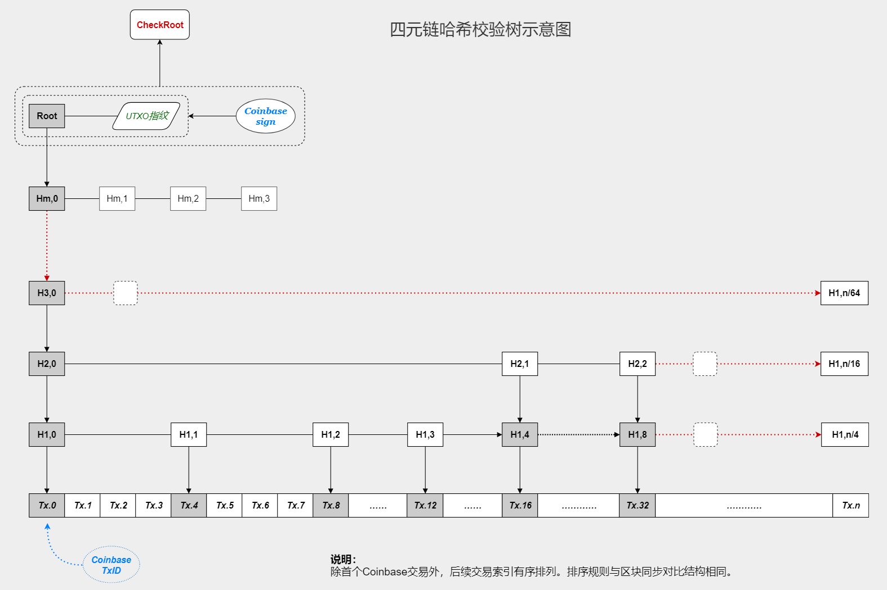

## 概念集

### 基本概念

#### 理想塊

按交易時間戳計算的應當及時收錄該筆交易的區塊，稱為交易的理想塊。
如果按6分鈡的固定出塊時間計算：`理想塊高度 = （交易時間戳 - 創始塊時間戳） / 6分鈡 + 1`。

按理想塊定位交易可以不受實際收錄區塊的影響，UTXO集就是這樣對交易進行分級管理的，便於快速定位。
區塊査詢公共服務（blockqs）也應遵循同樣的規則，這可以解耦交易與實際打包的區塊。

> **註記：** 
> 區塊査詢服務器中包含有實際區塊，可以判斷哪些交易已經被確認。 
> 眞實區塊裏的交易索引包含有交易時間戳，因此可以快速定位到按理想塊布局的交易數據存儲。 

#### 末端區塊

區塊鏈當前最高高度處的區塊，卽當前最新的已確認區塊。這是一個動態變化的區塊。

#### 當前區塊

當前正在驗證交易，需要打包到一個新的區塊，該卽將創建但尚未創建的區塊稱為當前區塊。它是區塊鏈末端區塊的下一個區塊。

#### 鑄憑交易

根據規則，有資格參與鑄造競爭的歷史交易就稱為鑄憑交易，意卽 **鑄造依憑的交易**。

#### 哈希相似性

如果將兩條哈希序列描繪成兩條曲綫，兩條曲綫的相似度稱為哈希相似性。衡量這種相似性的算法可以有多種，本設計中采用4字節整數切分計算相位差和（相同位置整數值差的絕對值之和）來表達。

#### 幣權銷毀

一筆交易的全部輸入所藴含的幣權（幣量x幣齡）之和，卽是交易所銷毀的幣權。因為幣齡被重置為零，所以這是一種銷毀邏輯。

#### 鑄造委托

交易的構造者可以在交易頭中指定一個鑄造地址，當交易充當鑄憑交易時，節點會驗證對區塊的簽名是否為該鑄造者。這是一種外部委托機製，提供冷挖礦或委托專業者鑄造區塊的能力。

#### 歷史標記

交易的構造者需要在交易頭中設置一個適當長度的序列，該序列是主鏈-11號歷史區塊的哈希值的一部分（前段）。這可以實現交易對主鏈的綁定，為分叉發現和分叉競爭提供辯識依據。序列長度可能是20字節，應當足夠長以抵擋當前哈希礦機的算力。

#### 哈希塑造

因為鑄造競爭是評比哈希相似性，假設攻擊者有足夠強大的哈希算力，則可能塑造交易或區塊的哈希摘要，以爭取更好的哈希值來提昇自己的競爭力。

交易ID由用戶構建，因此可以被任意塑造，區塊的哈希則隻能由鑄造者塑造。因為鑄憑哈希的算法約束，區塊哈希塑造隻能針對某單一交易（而非一組交易）。

#### 擇優憑證

鑄造候選的鑄憑交易在一定時間內會被收集和篩選，最終形成一個32名候選者的擇優池。作為一種安全性設計，擇優池中的前2名候選者的權重值（哈希相似性對比的相位差和）會被存放在區塊頭內，其權重證明也需要保存在Coinbase交易中。這證明了鑄造者的優質性，故名之擇優憑證。

#### 分叉合並

如果分叉眞的發生了，當主鏈競爭結束後，非主鏈的那條支鏈上的交易可以被主鏈上的新區塊合並。這是一個重要的友好性措施，它可以避免用戶在分叉階段選擇綁定主鏈的艱難，甚至影響繫統的可用性。

#### 未來交易

在交易的傳播過程中，相對於節點的當前實際時間，如果交易的時間戳屬於未來，它就是一筆 **未來交易**。這種相對性還可以針對區塊的出塊時間，如果交易的時間戳處於區塊的出塊時間點以及之後，它就是一筆相對於該區塊的未來交易。

未來的交易不能被區塊收錄，這是一個基本設計。遊離於區塊之外的未來交易需要等待眞實的時間到達之後，才能被收錄。

#### 錯時交易

對於一個節點來說，如果一筆交易的時間戳相對於眞實時間太晚，它們就被視為錯時交易（錯過了正確的時間）。這個概念被用於 **錯時延遲** 設計，它可以避免鑄造者對錯時交易的貪婪等待，以保證區塊的按時打包廣播。

#### 錯時延遲

**當出塊時間到達後，節點停止時間戳在出塊時間之前的錯時交易的轉播，直到區塊被創建、廣播並確定下來。之後再恢復這些交易的傳輸**。這是一個端點約定，當出塊時間到達後，如果可以被打包的交易已經被明確規定暫停廣播，鑄造者就沒有理由再等待了。

錯時延遲不會影響該區塊下一區塊時段內的交易的正常轉播，卽不會影響當前區塊的正常工作。當措施延遲所約束的區塊最終確定後，那些被暫時阻擋的錯時交易會恢復傳播，因此當前區塊依然可以收集到它們（**註**：前一區塊的確認不會拖延到當前區塊結束時）。

#### 時序保障

明確雙花的交易可能是一種糾正行為，但這種糾正需要在一個時間限度內。如果兩筆雙花交易的發布時間相差較大，它們會被視為攻擊而被節點丟棄。

對於一個中轉節點來說，接收到交易驗證合法後會存儲到內存池中，同時也需要記錄交易的實際收到時間。如果發現新收到的交易是一筆雙花交易，它們根據下面的規則行事。

1. 如果新交易的時間戳更晚（值更大），則忽略丟棄。因為區塊應當收錄更早的交易。
2. 如果新交易的時間戳更早（值更小），則檢査時間戳與當前實際時間的誤差：1分鈡內視為更正交易正常轉播，否則視為雙花攻擊丟棄。
3. 如果新交易的時間戳與原交易相同，則檢査原交易的實際收錄時間，如果在1分鈡之內，也視為正常的更正交易轉播，否則視為雙花攻擊丟棄。

這是一個零確認安全機製的輔助措施，與適時轉播一起工作。

#### 最低交易費

用戶構造的交易中必須包含一定額度以上的交易費，這個額度就是最低交易費。它由前期的平均交易費自動計算而來：

**繫統每 `24000個` 區塊（100天）統計一次，取平均值的 `1/5` 作為當前階段的最低交易費。**

最低交易費隻是作為一個端點約定（而不是協議）來運行，節點不會轉播交易費低於這一額度的交易。

這可以對 **大量的微塵交易** 攻擊有一定的防護效果，同時它也是零確認安全的輔助性措施之一，避免交易不被及時收錄以至於過期帶來的零確認失效問題。

#### 交易過期

未被收錄的交易超過一定時間後會作廢，這個期限可能是 `480個` 區塊（2天）。這是按交易的時間戳和當前時間對比判斷的。它的意義在於：

1. 縮減未確認交易的規模。
2. 提昇時間因子的價值，為某些應用提供條件。

人們不應當期待一筆超過2天都未完成（確認）的交易依然有效，相反，它可能帶來一種漫長期待的心理負面情緒。

#### 節點評估

**基本原則**

- 違反強製合法性規則（協議）的節點會被加入黑名單並斷開連接。
- 違反寬鬆約定的節點會被容忍，雖然保持連接但其違約會被中斷（類似於分布式阻斷）。

#### 開放式存儲

區塊數據和交易裏的附件被公共服務網絡存儲，這分離了區塊鏈的負載。公共服務網絡的數據存儲是P2P模式的，服務器通過 **數據緊缺性感知** 來獲知數據是否需要補充冗餘存儲。這是一種開放的架構，並且十分簡單。

開放式存儲可能帶來隱私性問題，這可以通過加密來緩解，但更重要的是：你不應當把重要的隱私性數據存放在公網上。

-------------------------------------------------------------------------------

### 交易相關

#### 交易ID

交易頭的哈希摘要，可能由兩種不同的哈希算法嵌套計算而來。`32字節`。

#### 交易索引

在實際區塊中表達交易存在性的索引，由32字節的交易ID後附加8字節的時間戳構成。`40字節`。
時間戳附加在ID之後，使得不會影響交易索引的「按分段」排序的規則。同時，時間戳可以提供「理想塊」的高度計算。

#### 交易定位

理論上，對目標交易的引用僅需交易ID卽可，ID擁有可靠的唯一性。但在現實使用中，單純的交易ID並不容易構建出一個結構良好的存儲引用繫統。
本設計中采用理想塊高度對交易進行「年/日/塊/」三級基礎定位，然後再用交易ID的前8字節進行255分段，構造出一個友好的引用結構。

因此對交易的檢索需要包含：理想塊高度（4字節）和交易ID（32字節）。如果需要定位交易內的輸出項，則再包含一個2字節的輸出項下標。

#### 輸出指引

UTXO集內對交易中輸出項的使用狀態標記，可判斷輸出項是否未花費。每一項占用一個標誌位，一筆交易中最多支持64k項輸出，因此標記位最多占用：`65536/8 = 8192字節`。

每一筆交易的輸出指引計算哈希摘要後，作為該筆交易的使用狀態指紋，用於匯總計算UTXO指紋。

#### 交易消息

在網絡上廣播的完整交易數據稱為交易消息，包含：

1. 交易ID + 簽名數據集校驗碼。`32+8` 字節。
2. 交易頭數據 + 交易體數據 + 輸入源的簽名數據集。

-------------------------------------------------------------------------------

### 其它

#### 四元鏈哈希樹

模擬默克爾樹（Merkle），但每一層級為鏈表結構，上層的每一個節點指向下層鏈段的首個節點。
父節點哈希值 = Hash256（4個子節點哈希值串聯）。

圖示：

說明：
- `Tx.0, Tx.1...` 為後置8字節時間戳的交易ID，有序排列。
- `H1,0，H1,2...` 為下級子鏈段4個成員合並計算的哈希摘要。
- 每一層節點都可以形成一條貫穿的鏈表，能夠直接獲取某層級的成員，甚至跨層提取。
- `Coinbase sign` 為鑄造者對哈希樹根（Root）和 `UTXO指紋` 的簽名數據，共同參與 `CheckRoot` 計算。

#### 組隊校驗

不同的節點可以組隊一起校驗交易，通過恰當的分工管理和冗餘復核設計，讓離散的節點協作完成一個區塊全部交易的校驗工作，稱為組隊校驗。交易天生擁有獨立的邏輯，一筆交易就是一些信用完整轉移的過程，因此按交易為單位的分工協作是可能的。

這可以視為一種**縱向分片**的負載分離模型，讓區塊鏈的工作能力大幅提昇，而且這種模式下計算力的擴展也很靈活。

#### 首領輸入與首領校驗

為了支持交易儘快地在網絡上傳播，便於全網更有效率的處理交易，端點對於接收到的交易，僅驗證其首筆輸入是否合法。該首筆輸入卽稱為首領輸入（Leader TX）。僅驗證首領輸入的行為稱為首領校驗。

為了避免攻擊者構造大量首領輸入合法但後續輸入非法的交易實施洪流攻擊，這裏有一個簡單的約束和一個黑名單抑製措施：

- **約束**：首領輸入必須是全部輸入裏幣權最大者。
- **抑製**：完整校驗失敗的首領輸入會進入黑名單。

考慮容忍偶爾的失誤，進入黑名單並不是永久的，這個期限可能在3天以上。如果這是一個失誤，或者攻擊者想要花掉這筆輸入，他們要麽等待有效期過後，要麽可以將之編入一筆有更高幣權首領輸入的交易裏。這是允許的。

-------------------------------------------------------------------------------

下一篇：[附2：攻擊與安全](附2.攻擊與安全.md) 
下一篇：[用例參考：examples/*.md](examples/) 
